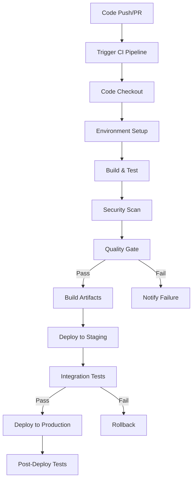

# CI/CD Pipeline Setup

## Overview
This document defines the Continuous Integration and Continuous Deployment pipeline for the D&D AI Campaign Management System using GitHub Actions, including build automation, testing, security scanning, and deployment strategies.

---

## Pipeline Architecture

### Pipeline Flow


### Environment Strategy
- **Development**: Feature branch builds and PR validation
- **Staging**: Integration testing and pre-production validation
- **Production**: Stable releases with blue-green deployment

---

## GitHub Actions Workflows

### Main CI/CD Workflow
```yaml
# .github/workflows/ci-cd.yml
name: CI/CD Pipeline

on:
  push:
    branches: [ main, develop ]
  pull_request:
    branches: [ main, develop ]
  release:
    types: [ published ]

env:
  DOTNET_VERSION: '8.0.x'
  NODE_VERSION: '18.x'
  FLUTTER_VERSION: '3.16.x'
  REGISTRY: ghcr.io
  IMAGE_NAME: ${{ github.repository }}

jobs:
  # Job 1: Build and Test .NET Services
  build-dotnet:
    runs-on: ubuntu-latest
    
    steps:
    - name: Checkout code
      uses: actions/checkout@v4
      with:
        fetch-depth: 0  # Full history for SonarCloud
    
    - name: Setup .NET
      uses: actions/setup-dotnet@v4
      with:
        dotnet-version: ${{ env.DOTNET_VERSION }}
    
    - name: Cache NuGet packages
      uses: actions/cache@v3
      with:
        path: ~/.nuget/packages
        key: ${{ runner.os }}-nuget-${{ hashFiles('**/*.csproj') }}
        restore-keys: |
          ${{ runner.os }}-nuget-
    
    - name: Restore dependencies
      run: dotnet restore
    
    - name: Build solution
      run: dotnet build --configuration Release --no-restore
    
    - name: Run unit tests
      run: |
        dotnet test --configuration Release --no-build \
          --logger trx --results-directory ./TestResults \
          --collect:"XPlat Code Coverage" \
          --settings coverlet.runsettings
    
    - name: Upload test results
      uses: actions/upload-artifact@v3
      if: always()
      with:
        name: test-results-dotnet
        path: TestResults/
    
    - name: Code coverage report
      uses: codecov/codecov-action@v3
      with:
        files: ./TestResults/*/coverage.cobertura.xml
        flags: dotnet
        name: codecov-dotnet
    
    - name: Build Docker images
      run: |
        docker build -f src/Services/CampaignService/Dockerfile -t campaign-service:${{ github.sha }} .
        docker build -f src/Services/CharacterService/Dockerfile -t character-service:${{ github.sha }} .
        docker build -f src/Services/AIGateway/Dockerfile -t ai-gateway:${{ github.sha }} .
        docker build -f src/Gateway/Dockerfile -t api-gateway:${{ github.sha }} .
    
    - name: Save Docker images
      run: |
        docker save campaign-service:${{ github.sha }} | gzip > campaign-service.tar.gz
        docker save character-service:${{ github.sha }} | gzip > character-service.tar.gz
        docker save ai-gateway:${{ github.sha }} | gzip > ai-gateway.tar.gz
        docker save api-gateway:${{ github.sha }} | gzip > api-gateway.tar.gz
    
    - name: Upload Docker artifacts
      uses: actions/upload-artifact@v3
      with:
        name: docker-images
        path: |
          campaign-service.tar.gz
          character-service.tar.gz
          ai-gateway.tar.gz
          api-gateway.tar.gz
        retention-days: 7

  # Job 2: Build and Test Flutter App
  build-flutter:
    runs-on: ubuntu-latest
    
    steps:
    - name: Checkout code
      uses: actions/checkout@v4
    
    - name: Setup Flutter
      uses: subosito/flutter-action@v2
      with:
        flutter-version: ${{ env.FLUTTER_VERSION }}
        channel: 'stable'
    
    - name: Cache Flutter packages
      uses: actions/cache@v3
      with:
        path: |
          ${{ env.FLUTTER_ROOT }}/.pub-cache
          ${{ github.workspace }}/src/Client/dnd_campaign_manager/.dart_tool
        key: ${{ runner.os }}-flutter-${{ hashFiles('**/pubspec.yaml') }}
        restore-keys: |
          ${{ runner.os }}-flutter-
    
    - name: Install dependencies
      working-directory: src/Client/dnd_campaign_manager
      run: flutter pub get
    
    - name: Analyze code
      working-directory: src/Client/dnd_campaign_manager
      run: flutter analyze --fatal-infos
    
    - name: Run tests
      working-directory: src/Client/dnd_campaign_manager
      run: flutter test --coverage
    
    - name: Upload coverage
      uses: codecov/codecov-action@v3
      with:
        files: src/Client/dnd_campaign_manager/coverage/lcov.info
        flags: flutter
        name: codecov-flutter
    
    - name: Build web app
      working-directory: src/Client/dnd_campaign_manager
      run: flutter build web --release --web-renderer canvaskit
    
    - name: Upload web build
      uses: actions/upload-artifact@v3
      with:
        name: flutter-web-build
        path: src/Client/dnd_campaign_manager/build/web/

  # Job 3: Security Scanning
  security-scan:
    runs-on: ubuntu-latest
    needs: [build-dotnet]
    
    steps:
    - name: Checkout code
      uses: actions/checkout@v4
    
    - name: Run Trivy vulnerability scanner
      uses: aquasecurity/trivy-action@master
      with:
        scan-type: 'fs'
        scan-ref: '.'
        format: 'sarif'
        output: 'trivy-results.sarif'
    
    - name: Upload Trivy scan results
      uses: github/codeql-action/upload-sarif@v2
      if: always()
      with:
        sarif_file: 'trivy-results.sarif'
    
    - name: .NET Security Scan
      run: |
        dotnet list package --vulnerable --include-transitive 2>&1 | tee vulnerability-report.txt
        if grep -q "vulnerable" vulnerability-report.txt; then
          echo "Vulnerable packages found!"
          exit 1
        fi
    
    - name: OWASP ZAP Baseline Scan
      uses: zaproxy/action-baseline@v0.7.0
      with:
        target: 'https://api.staging.dndcampaign.dev'

  # Job 4: Code Quality Analysis
  code-quality:
    runs-on: ubuntu-latest
    needs: [build-dotnet]
    
    steps:
    - name: Checkout code
      uses: actions/checkout@v4
      with:
        fetch-depth: 0
    
    - name: Setup .NET
      uses: actions/setup-dotnet@v4
      with:
        dotnet-version: ${{ env.DOTNET_VERSION }}
    
    - name: Cache SonarCloud packages
      uses: actions/cache@v3
      with:
        path: ~\sonar\cache
        key: ${{ runner.os }}-sonar
        restore-keys: ${{ runner.os }}-sonar
    
    - name: Install SonarCloud scanner
      run: dotnet tool install --global dotnet-sonarscanner
    
    - name: Build and analyze
      env:
        GITHUB_TOKEN: ${{ secrets.GITHUB_TOKEN }}
        SONAR_TOKEN: ${{ secrets.SONAR_TOKEN }}
      run: |
        dotnet-sonarscanner begin /k:"dnd-ai-campaign-manager" /o:"your-org" /d:sonar.login="${{ secrets.SONAR_TOKEN }}" /d:sonar.host.url="https://sonarcloud.io"
        dotnet build --configuration Release
        dotnet test --configuration Release --collect:"XPlat Code Coverage" -- DataCollectionRunSettings.DataCollectors.DataCollector.Configuration.Format=opencover
        dotnet-sonarscanner end /d:sonar.login="${{ secrets.SONAR_TOKEN }}"

  # Job 5: Integration Tests
  integration-tests:
    runs-on: ubuntu-latest
    needs: [build-dotnet]
    if: github.event_name == 'push' || github.event_name == 'release'
    
    services:
      postgres:
        image: postgres:15
        env:
          POSTGRES_USER: testuser
          POSTGRES_PASSWORD: testpass
          POSTGRES_DB: testdb
        options: >-
          --health-cmd pg_isready
          --health-interval 10s
          --health-timeout 5s
          --health-retries 5
        ports:
          - 5432:5432
      
      redis:
        image: redis:7
        options: >-
          --health-cmd "redis-cli ping"
          --health-interval 10s
          --health-timeout 5s
          --health-retries 5
        ports:
          - 6379:6379
    
    steps:
    - name: Checkout code
      uses: actions/checkout@v4
    
    - name: Setup .NET
      uses: actions/setup-dotnet@v4
      with:
        dotnet-version: ${{ env.DOTNET_VERSION }}
    
    - name: Download Docker images
      uses: actions/download-artifact@v3
      with:
        name: docker-images
    
    - name: Load Docker images
      run: |
        docker load < campaign-service.tar.gz
        docker load < character-service.tar.gz
        docker load < ai-gateway.tar.gz
        docker load < api-gateway.tar.gz
    
    - name: Run integration tests
      env:
        ConnectionStrings__DefaultConnection: "Host=localhost;Port=5432;Database=testdb;Username=testuser;Password=testpass"
        Redis__ConnectionString: "localhost:6379"
        OpenAI__ApiKey: "test-key"
      run: dotnet test tests/IntegrationTests/ --configuration Release --logger trx

  # Job 6: Deploy to Staging
  deploy-staging:
    runs-on: ubuntu-latest
    needs: [build-dotnet, build-flutter, security-scan, integration-tests]
    if: github.ref == 'refs/heads/develop'
    environment: staging
    
    steps:
    - name: Checkout code
      uses: actions/checkout@v4
    
    - name: Download Docker images
      uses: actions/download-artifact@v3
      with:
        name: docker-images
    
    - name: Download Flutter build
      uses: actions/download-artifact@v3
      with:
        name: flutter-web-build
        path: flutter-web/
    
    - name: Configure AWS credentials
      uses: aws-actions/configure-aws-credentials@v4
      with:
        aws-access-key-id: ${{ secrets.AWS_ACCESS_KEY_ID }}
        aws-secret-access-key: ${{ secrets.AWS_SECRET_ACCESS_KEY }}
        aws-region: us-east-1
    
    - name: Login to Amazon ECR
      id: login-ecr
      uses: aws-actions/amazon-ecr-login@v2
    
    - name: Load and push Docker images
      env:
        REGISTRY: ${{ steps.login-ecr.outputs.registry }}
        REPOSITORY_PREFIX: dnd-campaign-manager
      run: |
        docker load < campaign-service.tar.gz
        docker load < character-service.tar.gz
        docker load < ai-gateway.tar.gz
        docker load < api-gateway.tar.gz
        
        docker tag campaign-service:${{ github.sha }} $REGISTRY/$REPOSITORY_PREFIX-campaign:staging-${{ github.sha }}
        docker tag character-service:${{ github.sha }} $REGISTRY/$REPOSITORY_PREFIX-character:staging-${{ github.sha }}
        docker tag ai-gateway:${{ github.sha }} $REGISTRY/$REPOSITORY_PREFIX-ai:staging-${{ github.sha }}
        docker tag api-gateway:${{ github.sha }} $REGISTRY/$REPOSITORY_PREFIX-gateway:staging-${{ github.sha }}
        
        docker push $REGISTRY/$REPOSITORY_PREFIX-campaign:staging-${{ github.sha }}
        docker push $REGISTRY/$REPOSITORY_PREFIX-character:staging-${{ github.sha }}
        docker push $REGISTRY/$REPOSITORY_PREFIX-ai:staging-${{ github.sha }}
        docker push $REGISTRY/$REPOSITORY_PREFIX-gateway:staging-${{ github.sha }}
    
    - name: Deploy to EKS Staging
      run: |
        aws eks update-kubeconfig --region us-east-1 --name dnd-staging-cluster
        
        # Update Kubernetes manifests with new image tags
        sed -i 's|{{CAMPAIGN_IMAGE}}|${{ steps.login-ecr.outputs.registry }}/dnd-campaign-manager-campaign:staging-${{ github.sha }}|g' infrastructure/kubernetes/staging/campaign-service.yaml
        sed -i 's|{{CHARACTER_IMAGE}}|${{ steps.login-ecr.outputs.registry }}/dnd-campaign-manager-character:staging-${{ github.sha }}|g' infrastructure/kubernetes/staging/character-service.yaml
        sed -i 's|{{AI_IMAGE}}|${{ steps.login-ecr.outputs.registry }}/dnd-campaign-manager-ai:staging-${{ github.sha }}|g' infrastructure/kubernetes/staging/ai-gateway.yaml
        sed -i 's|{{GATEWAY_IMAGE}}|${{ steps.login-ecr.outputs.registry }}/dnd-campaign-manager-gateway:staging-${{ github.sha }}|g' infrastructure/kubernetes/staging/api-gateway.yaml
        
        kubectl apply -f infrastructure/kubernetes/staging/
        kubectl rollout status deployment/campaign-service -n staging
        kubectl rollout status deployment/character-service -n staging
        kubectl rollout status deployment/ai-gateway -n staging
        kubectl rollout status deployment/api-gateway -n staging
    
    - name: Deploy Flutter to S3
      run: |
        aws s3 sync flutter-web/ s3://dnd-campaign-staging-web --delete
        aws cloudfront create-invalidation --distribution-id ${{ secrets.STAGING_CLOUDFRONT_DISTRIBUTION_ID }} --paths "/*"
    
    - name: Run smoke tests
      run: |
        # Wait for deployment to stabilize
        sleep 30
        
        # Run basic health checks
        curl -f https://api.staging.dndcampaign.dev/health || exit 1
        curl -f https://staging.dndcampaign.dev || exit 1

  # Job 7: Deploy to Production
  deploy-production:
    runs-on: ubuntu-latest
    needs: [deploy-staging]
    if: github.event_name == 'release'
    environment: production
    
    steps:
    - name: Checkout code
      uses: actions/checkout@v4
    
    - name: Download Docker images
      uses: actions/download-artifact@v3
      with:
        name: docker-images
    
    - name: Download Flutter build
      uses: actions/download-artifact@v3
      with:
        name: flutter-web-build
        path: flutter-web/
    
    - name: Configure AWS credentials
      uses: aws-actions/configure-aws-credentials@v4
      with:
        aws-access-key-id: ${{ secrets.AWS_ACCESS_KEY_ID }}
        aws-secret-access-key: ${{ secrets.AWS_SECRET_ACCESS_KEY }}
        aws-region: us-east-1
    
    - name: Login to Amazon ECR
      id: login-ecr
      uses: aws-actions/amazon-ecr-login@v2
    
    - name: Load and push Docker images
      env:
        REGISTRY: ${{ steps.login-ecr.outputs.registry }}
        REPOSITORY_PREFIX: dnd-campaign-manager
        VERSION: ${{ github.event.release.tag_name }}
      run: |
        docker load < campaign-service.tar.gz
        docker load < character-service.tar.gz
        docker load < ai-gateway.tar.gz
        docker load < api-gateway.tar.gz
        
        docker tag campaign-service:${{ github.sha }} $REGISTRY/$REPOSITORY_PREFIX-campaign:$VERSION
        docker tag character-service:${{ github.sha }} $REGISTRY/$REPOSITORY_PREFIX-character:$VERSION
        docker tag ai-gateway:${{ github.sha }} $REGISTRY/$REPOSITORY_PREFIX-ai:$VERSION
        docker tag api-gateway:${{ github.sha }} $REGISTRY/$REPOSITORY_PREFIX-gateway:$VERSION
        
        docker push $REGISTRY/$REPOSITORY_PREFIX-campaign:$VERSION
        docker push $REGISTRY/$REPOSITORY_PREFIX-character:$VERSION
        docker push $REGISTRY/$REPOSITORY_PREFIX-ai:$VERSION
        docker push $REGISTRY/$REPOSITORY_PREFIX-gateway:$VERSION
    
    - name: Blue-Green Deployment
      run: |
        aws eks update-kubeconfig --region us-east-1 --name dnd-production-cluster
        
        # Deploy to green environment
        sed -i 's|{{CAMPAIGN_IMAGE}}|${{ steps.login-ecr.outputs.registry }}/dnd-campaign-manager-campaign:${{ github.event.release.tag_name }}|g' infrastructure/kubernetes/production/green/campaign-service.yaml
        sed -i 's|{{CHARACTER_IMAGE}}|${{ steps.login-ecr.outputs.registry }}/dnd-campaign-manager-character:${{ github.event.release.tag_name }}|g' infrastructure/kubernetes/production/green/character-service.yaml
        sed -i 's|{{AI_IMAGE}}|${{ steps.login-ecr.outputs.registry }}/dnd-campaign-manager-ai:${{ github.event.release.tag_name }}|g' infrastructure/kubernetes/production/green/ai-gateway.yaml
        sed -i 's|{{GATEWAY_IMAGE}}|${{ steps.login-ecr.outputs.registry }}/dnd-campaign-manager-gateway:${{ github.event.release.tag_name }}|g' infrastructure/kubernetes/production/green/api-gateway.yaml
        
        kubectl apply -f infrastructure/kubernetes/production/green/
        kubectl rollout status deployment/campaign-service-green -n production
        kubectl rollout status deployment/character-service-green -n production
        kubectl rollout status deployment/ai-gateway-green -n production
        kubectl rollout status deployment/api-gateway-green -n production
    
    - name: Health check green deployment
      run: |
        # Test green deployment internally
        kubectl port-forward service/api-gateway-green 8080:80 -n production &
        sleep 10
        curl -f http://localhost:8080/health || exit 1
        pkill -f "kubectl port-forward"
    
    - name: Switch traffic to green
      run: |
        # Update service selectors to point to green deployment
        kubectl patch service api-gateway -n production -p '{"spec":{"selector":{"version":"green"}}}'
        kubectl patch service campaign-service -n production -p '{"spec":{"selector":{"version":"green"}}}'
        kubectl patch service character-service -n production -p '{"spec":{"selector":{"version":"green"}}}'
        kubectl patch service ai-gateway -n production -p '{"spec":{"selector":{"version":"green"}}}'
    
    - name: Deploy Flutter to production S3
      run: |
        aws s3 sync flutter-web/ s3://dnd-campaign-production-web --delete
        aws cloudfront create-invalidation --distribution-id ${{ secrets.PRODUCTION_CLOUDFRONT_DISTRIBUTION_ID }} --paths "/*"
    
    - name: Final health checks
      run: |
        sleep 30
        curl -f https://api.dndcampaign.dev/health || exit 1
        curl -f https://dndcampaign.dev || exit 1
    
    - name: Clean up blue deployment
      run: |
        # Remove old blue deployment after successful green deployment
        kubectl delete deployment campaign-service-blue character-service-blue ai-gateway-blue api-gateway-blue -n production --ignore-not-found=true
```

---

## Branch Protection and PR Policies

### Branch Protection Rules
```yaml
# .github/branch-protection.yml (using GitHub CLI or API)
branches:
  main:
    protection:
      required_status_checks:
        strict: true
        contexts:
          - build-dotnet
          - build-flutter
          - security-scan
          - code-quality
      enforce_admins: true
      required_pull_request_reviews:
        required_approving_review_count: 2
        dismiss_stale_reviews: true
        require_code_owner_reviews: true
      restrictions:
        users: []
        teams: ["core-team"]
  develop:
    protection:
      required_status_checks:
        strict: true
        contexts:
          - build-dotnet
          - build-flutter
          - security-scan
      required_pull_request_reviews:
        required_approving_review_count: 1
        dismiss_stale_reviews: true
```

### Pull Request Template
```markdown
<!-- .github/pull_request_template.md -->
## Description
Brief description of changes made.

## Type of Change
- [ ] Bug fix (non-breaking change which fixes an issue)
- [ ] New feature (non-breaking change which adds functionality)
- [ ] Breaking change (fix or feature that would cause existing functionality to not work as expected)
- [ ] Documentation update

## How Has This Been Tested?
- [ ] Unit tests
- [ ] Integration tests
- [ ] Manual testing

## Checklist:
- [ ] My code follows the style guidelines of this project
- [ ] I have performed a self-review of my own code
- [ ] I have commented my code, particularly in hard-to-understand areas
- [ ] I have made corresponding changes to the documentation
- [ ] My changes generate no new warnings
- [ ] I have added tests that prove my fix is effective or that my feature works
- [ ] New and existing unit tests pass locally with my changes
- [ ] Any dependent changes have been merged and published
```

---

## Environment Configuration

### Staging Environment
```yaml
# .github/environments/staging.yml
environment:
  name: staging
  url: https://staging.dndcampaign.dev
  protection_rules:
    - type: required_reviewers
      reviewers:
        - team: devops-team
  secrets:
    AWS_ACCESS_KEY_ID: ${{ secrets.STAGING_AWS_ACCESS_KEY_ID }}
    AWS_SECRET_ACCESS_KEY: ${{ secrets.STAGING_AWS_SECRET_ACCESS_KEY }}
    DATABASE_CONNECTION_STRING: ${{ secrets.STAGING_DATABASE_CONNECTION_STRING }}
    REDIS_CONNECTION_STRING: ${{ secrets.STAGING_REDIS_CONNECTION_STRING }}
    OPENAI_API_KEY: ${{ secrets.STAGING_OPENAI_API_KEY }}
```

### Production Environment
```yaml
# .github/environments/production.yml
environment:
  name: production
  url: https://dndcampaign.dev
  protection_rules:
    - type: required_reviewers
      reviewers:
        - team: senior-team
    - type: wait_timer
      wait_timer_minutes: 5
  secrets:
    AWS_ACCESS_KEY_ID: ${{ secrets.PRODUCTION_AWS_ACCESS_KEY_ID }}
    AWS_SECRET_ACCESS_KEY: ${{ secrets.PRODUCTION_AWS_SECRET_ACCESS_KEY }}
    DATABASE_CONNECTION_STRING: ${{ secrets.PRODUCTION_DATABASE_CONNECTION_STRING }}
    REDIS_CONNECTION_STRING: ${{ secrets.PRODUCTION_REDIS_CONNECTION_STRING }}
    OPENAI_API_KEY: ${{ secrets.PRODUCTION_OPENAI_API_KEY }}
```

---

## Quality Gates and Metrics

### Code Coverage Requirements
```yaml
# coverlet.runsettings
<?xml version="1.0" encoding="utf-8" ?>
<RunSettings>
  <DataCollectionRunSettings>
    <DataCollectors>
      <DataCollector friendlyName="XPlat code coverage">
        <Configuration>
          <Format>cobertura</Format>
          <Threshold>80</Threshold>
          <ThresholdType>line</ThresholdType>
          <ThresholdStat>total</ThresholdStat>
          <ExcludeByFile>**/Migrations/**,**/Program.cs,**/Startup.cs</ExcludeByFile>
        </Configuration>
      </DataCollector>
    </DataCollectors>
  </DataCollectionRunSettings>
</RunSettings>
```

### SonarQube Quality Gate
```properties
# sonar-project.properties
sonar.projectKey=dnd-ai-campaign-manager
sonar.organization=your-org
sonar.sources=src/
sonar.tests=tests/
sonar.exclusions=**/Migrations/**,**/wwwroot/**,**/bin/**,**/obj/**
sonar.coverage.exclusions=**/Program.cs,**/Startup.cs,**/*Exception.cs
sonar.cs.vstest.reportsPaths=TestResults/*.trx
sonar.cs.opencover.reportsPaths=TestResults/*/coverage.opencover.xml
sonar.javascript.lcov.reportPaths=src/Client/dnd_campaign_manager/coverage/lcov.info

# Quality gate settings
sonar.qualitygate.wait=true
sonar.coverage.minimum=80
sonar.duplicated_lines_density.maximum=3
sonar.maintainability_rating.minimum=A
sonar.reliability_rating.minimum=A
sonar.security_rating.minimum=A
```

---

## Deployment Strategies

### Blue-Green Deployment Script
```bash
#!/bin/bash
# scripts/deploy-blue-green.sh

set -e

ENVIRONMENT=$1
VERSION=$2
NAMESPACE="production"

if [ -z "$ENVIRONMENT" ] || [ -z "$VERSION" ]; then
    echo "Usage: $0 <environment> <version>"
    exit 1
fi

echo "Starting blue-green deployment for $ENVIRONMENT with version $VERSION"

# Determine current color
CURRENT_COLOR=$(kubectl get service api-gateway -n $NAMESPACE -o jsonpath='{.spec.selector.version}')
if [ "$CURRENT_COLOR" = "blue" ]; then
    NEW_COLOR="green"
else
    NEW_COLOR="blue"
fi

echo "Current deployment: $CURRENT_COLOR, deploying to: $NEW_COLOR"

# Deploy new version
kubectl set image deployment/campaign-service-$NEW_COLOR campaign-service=dnd-campaign-manager-campaign:$VERSION -n $NAMESPACE
kubectl set image deployment/character-service-$NEW_COLOR character-service=dnd-campaign-manager-character:$VERSION -n $NAMESPACE
kubectl set image deployment/ai-gateway-$NEW_COLOR ai-gateway=dnd-campaign-manager-ai:$VERSION -n $NAMESPACE
kubectl set image deployment/api-gateway-$NEW_COLOR api-gateway=dnd-campaign-manager-gateway:$VERSION -n $NAMESPACE

# Wait for rollout to complete
kubectl rollout status deployment/campaign-service-$NEW_COLOR -n $NAMESPACE --timeout=600s
kubectl rollout status deployment/character-service-$NEW_COLOR -n $NAMESPACE --timeout=600s
kubectl rollout status deployment/ai-gateway-$NEW_COLOR -n $NAMESPACE --timeout=600s
kubectl rollout status deployment/api-gateway-$NEW_COLOR -n $NAMESPACE --timeout=600s

# Health check
echo "Performing health check on $NEW_COLOR deployment"
kubectl port-forward service/api-gateway-$NEW_COLOR 8080:80 -n $NAMESPACE &
PROXY_PID=$!
sleep 10

if curl -f http://localhost:8080/health; then
    echo "Health check passed, switching traffic to $NEW_COLOR"
    kill $PROXY_PID
    
    # Switch traffic
    kubectl patch service api-gateway -n $NAMESPACE -p "{\"spec\":{\"selector\":{\"version\":\"$NEW_COLOR\"}}}"
    kubectl patch service campaign-service -n $NAMESPACE -p "{\"spec\":{\"selector\":{\"version\":\"$NEW_COLOR\"}}}"
    kubectl patch service character-service -n $NAMESPACE -p "{\"spec\":{\"selector\":{\"version\":\"$NEW_COLOR\"}}}"
    kubectl patch service ai-gateway -n $NAMESPACE -p "{\"spec\":{\"selector\":{\"version\":\"$NEW_COLOR\"}}}"
    
    echo "Deployment successful! Traffic switched to $NEW_COLOR"
    echo "To rollback, run: ./scripts/rollback.sh $CURRENT_COLOR"
else
    echo "Health check failed, keeping traffic on $CURRENT_COLOR"
    kill $PROXY_PID
    exit 1
fi
```

### Rollback Script
```bash
#!/bin/bash
# scripts/rollback.sh

ROLLBACK_COLOR=$1
NAMESPACE="production"

if [ -z "$ROLLBACK_COLOR" ]; then
    echo "Usage: $0 <color_to_rollback_to>"
    exit 1
fi

echo "Rolling back to $ROLLBACK_COLOR deployment"

# Switch traffic back
kubectl patch service api-gateway -n $NAMESPACE -p "{\"spec\":{\"selector\":{\"version\":\"$ROLLBACK_COLOR\"}}}"
kubectl patch service campaign-service -n $NAMESPACE -p "{\"spec\":{\"selector\":{\"version\":\"$ROLLBACK_COLOR\"}}}"
kubectl patch service character-service -n $NAMESPACE -p "{\"spec\":{\"selector\":{\"version\":\"$ROLLBACK_COLOR\"}}}"
kubectl patch service ai-gateway -n $NAMESPACE -p "{\"spec\":{\"selector\":{\"version\":\"$ROLLBACK_COLOR\"}}}"

echo "Rollback completed! Traffic switched back to $ROLLBACK_COLOR"
```

---

## Monitoring and Alerting

### Pipeline Notifications
```yaml
# .github/workflows/notifications.yml
name: Pipeline Notifications

on:
  workflow_run:
    workflows: ["CI/CD Pipeline"]
    types:
      - completed

jobs:
  notify:
    runs-on: ubuntu-latest
    steps:
    - name: Notify Slack on Success
      if: ${{ github.event.workflow_run.conclusion == 'success' }}
      uses: 8398a7/action-slack@v3
      with:
        status: success
        text: "✅ Deployment successful for ${{ github.event.workflow_run.head_branch }}"
      env:
        SLACK_WEBHOOK_URL: ${{ secrets.SLACK_WEBHOOK_URL }}
    
    - name: Notify Slack on Failure
      if: ${{ github.event.workflow_run.conclusion == 'failure' }}
      uses: 8398a7/action-slack@v3
      with:
        status: failure
        text: "❌ Pipeline failed for ${{ github.event.workflow_run.head_branch }}"
      env:
        SLACK_WEBHOOK_URL: ${{ secrets.SLACK_WEBHOOK_URL }}
```

### Health Check Monitoring
```bash
#!/bin/bash
# scripts/health-check.sh

ENVIRONMENT=$1
BASE_URL=""

case $ENVIRONMENT in
  "staging")
    BASE_URL="https://api.staging.dndcampaign.dev"
    ;;
  "production")
    BASE_URL="https://api.dndcampaign.dev"
    ;;
  *)
    echo "Usage: $0 <staging|production>"
    exit 1
    ;;
esac

echo "Running health checks for $ENVIRONMENT environment"

# API Gateway Health Check
echo "Checking API Gateway..."
if curl -f -s "$BASE_URL/health" > /dev/null; then
    echo "✅ API Gateway is healthy"
else
    echo "❌ API Gateway health check failed"
    exit 1
fi

# Service-specific health checks
SERVICES=("campaigns" "characters" "ai" "npcs")

for service in "${SERVICES[@]}"; do
    echo "Checking $service service..."
    if curl -f -s "$BASE_URL/api/$service/health" > /dev/null; then
        echo "✅ $service service is healthy"
    else
        echo "❌ $service service health check failed"
        exit 1
    fi
done

# Database connectivity check
echo "Checking database connectivity..."
if curl -f -s "$BASE_URL/health/database" > /dev/null; then
    echo "✅ Database is healthy"
else
    echo "❌ Database health check failed"
    exit 1
fi

# Redis connectivity check
echo "Checking Redis connectivity..."
if curl -f -s "$BASE_URL/health/redis" > /dev/null; then
    echo "✅ Redis is healthy"
else
    echo "❌ Redis health check failed"
    exit 1
fi

echo "All health checks passed for $ENVIRONMENT! 🎉"
```

---

## Performance Testing

### Load Testing with K6
```javascript
// tests/performance/load-test.js
import http from 'k6/http';
import { check, sleep } from 'k6';
import { Rate } from 'k6/metrics';

const errorRate = new Rate('errors');

export let options = {
  stages: [
    { duration: '2m', target: 10 }, // Ramp up to 10 users
    { duration: '5m', target: 10 }, // Stay at 10 users
    { duration: '2m', target: 20 }, // Ramp up to 20 users
    { duration: '5m', target: 20 }, // Stay at 20 users
    { duration: '2m', target: 0 },  // Ramp down
  ],
  thresholds: {
    http_req_duration: ['p(95)<500'], // 95% of requests must complete within 500ms
    errors: ['rate<0.1'], // Error rate must be less than 10%
  },
};

const BASE_URL = __ENV.BASE_URL || 'https://api.staging.dndcampaign.dev';

export default function () {
  // Test campaign listing
  let listResponse = http.get(`${BASE_URL}/api/campaigns`, {
    headers: { 'Authorization': `Bearer ${__ENV.TEST_TOKEN}` },
  });
  
  check(listResponse, {
    'campaigns list status is 200': (r) => r.status === 200,
    'campaigns list response time < 200ms': (r) => r.timings.duration < 200,
  }) || errorRate.add(1);
  
  // Test character creation
  let characterPayload = JSON.stringify({
    name: `TestChar${Math.floor(Math.random() * 1000)}`,
    race: 'Human',
    characterClass: 'Fighter',
    abilityScores: {
      str: 15, dex: 14, con: 13, int: 12, wis: 10, cha: 8
    }
  });
  
  let createResponse = http.post(`${BASE_URL}/api/characters`, characterPayload, {
    headers: {
      'Content-Type': 'application/json',
      'Authorization': `Bearer ${__ENV.TEST_TOKEN}`,
    },
  });
  
  check(createResponse, {
    'character creation status is 201': (r) => r.status === 201,
    'character creation response time < 1s': (r) => r.timings.duration < 1000,
  }) || errorRate.add(1);
  
  sleep(1);
}
```

### Performance Testing Workflow
```yaml
# .github/workflows/performance-test.yml
name: Performance Testing

on:
  schedule:
    - cron: '0 2 * * *'  # Run nightly at 2 AM
  workflow_dispatch:
    inputs:
      environment:
        description: 'Environment to test'
        required: true
        default: 'staging'
        type: choice
        options:
          - staging
          - production

jobs:
  performance-test:
    runs-on: ubuntu-latest
    
    steps:
    - name: Checkout code
      uses: actions/checkout@v4
    
    - name: Install K6
      run: |
        sudo apt-key adv --keyserver hkp://keyserver.ubuntu.com:80 --recv-keys C5AD17C747E3415A3642D57D77C6C491D6AC1D69
        echo "deb https://dl.k6.io/deb stable main" | sudo tee /etc/apt/sources.list.d/k6.list
        sudo apt-get update
        sudo apt-get install k6
    
    - name: Run performance tests
      env:
        BASE_URL: ${{ github.event.inputs.environment == 'production' && 'https://api.dndcampaign.dev' || 'https://api.staging.dndcampaign.dev' }}
        TEST_TOKEN: ${{ secrets.PERFORMANCE_TEST_TOKEN }}
      run: |
        k6 run tests/performance/load-test.js --out json=performance-results.json
    
    - name: Upload performance results
      uses: actions/upload-artifact@v3
      with:
        name: performance-results
        path: performance-results.json
    
    - name: Analyze results
      run: |
        # Parse results and check against thresholds
        python scripts/analyze-performance.py performance-results.json
```

---

## Security and Compliance

### Security Scanning Configuration
```yaml
# .github/workflows/security-scan.yml
name: Security Scan

on:
  push:
    branches: [ main, develop ]
  pull_request:
    branches: [ main ]
  schedule:
    - cron: '0 3 * * 1'  # Weekly on Monday at 3 AM

jobs:
  dependency-scan:
    runs-on: ubuntu-latest
    
    steps:
    - name: Checkout code
      uses: actions/checkout@v4
    
    - name: Run Dependabot Security Updates
      uses: dependabot/action@v1
      with:
        github-token: ${{ secrets.GITHUB_TOKEN }}
    
    - name: .NET Dependency Check
      run: |
        dotnet restore
        dotnet list package --vulnerable --include-transitive > vulnerability-report.txt
        cat vulnerability-report.txt
        
        if grep -q "has the following vulnerable packages" vulnerability-report.txt; then
          echo "❌ Vulnerable packages found!"
          exit 1
        else
          echo "✅ No vulnerable packages found"
        fi
    
    - name: Flutter Dependency Audit
      working-directory: src/Client/dnd_campaign_manager
      run: |
        flutter pub deps --json > deps.json
        # Check for known vulnerabilities in Flutter packages
        dart pub audit
  
  container-scan:
    runs-on: ubuntu-latest
    
    steps:
    - name: Checkout code
      uses: actions/checkout@v4
    
    - name: Build test image
      run: docker build -f src/Services/CampaignService/Dockerfile -t campaign-service:test .
    
    - name: Run Trivy container scan
      uses: aquasecurity/trivy-action@master
      with:
        image-ref: 'campaign-service:test'
        format: 'sarif'
        output: 'trivy-container-results.sarif'
    
    - name: Upload Trivy scan results
      uses: github/codeql-action/upload-sarif@v2
      with:
        sarif_file: 'trivy-container-results.sarif'
  
  secrets-scan:
    runs-on: ubuntu-latest
    
    steps:
    - name: Checkout code
      uses: actions/checkout@v4
      with:
        fetch-depth: 0
    
    - name: Run TruffleHog OSS
      uses: trufflesecurity/trufflehog@main
      with:
        path: ./
        base: main
        head: HEAD
        extra_args: --debug --only-verified
```

### Compliance Checks
```yaml
# .github/workflows/compliance.yml
name: Compliance Checks

on:
  push:
    branches: [ main ]
  schedule:
    - cron: '0 4 * * 1'  # Weekly compliance check

jobs:
  gdpr-compliance:
    runs-on: ubuntu-latest
    
    steps:
    - name: Checkout code
      uses: actions/checkout@v4
    
    - name: Check for PII handling
      run: |
        # Scan for potential PII fields and ensure proper handling
        grep -r "email\|phone\|address\|ssn" src/ || true
        
        # Verify data encryption configurations
        grep -r "encrypt\|hash" src/Services/ || true
        
        # Check for GDPR compliance markers
        if ! grep -r "GDPR\|data-retention\|user-consent" src/; then
          echo "❌ GDPR compliance markers not found"
          exit 1
        fi
  
  license-compliance:
    runs-on: ubuntu-latest
    
    steps:
    - name: Checkout code
      uses: actions/checkout@v4
    
    - name: Check .NET package licenses
      run: |
        dotnet restore
        dotnet tool install --global dotnet-project-licenses
        dotnet-project-licenses --input . --output-format json > licenses.json
        
        # Check for prohibited licenses
        if grep -i "gpl\|agpl\|copyleft" licenses.json; then
          echo "❌ Prohibited licenses found!"
          exit 1
        fi
    
    - name: Check Flutter package licenses
      working-directory: src/Client/dnd_campaign_manager
      run: |
        flutter pub deps --json > flutter-deps.json
        # Custom script to check Flutter package licenses
        python ../../../scripts/check-flutter-licenses.py flutter-deps.json
```

---

## Disaster Recovery and Backup

### Database Backup Automation
```yaml
# .github/workflows/backup.yml
name: Database Backup

on:
  schedule:
    - cron: '0 1 * * *'  # Daily at 1 AM
  workflow_dispatch:

jobs:
  backup-database:
    runs-on: ubuntu-latest
    
    steps:
    - name: Configure AWS credentials
      uses: aws-actions/configure-aws-credentials@v4
      with:
        aws-access-key-id: ${{ secrets.AWS_ACCESS_KEY_ID }}
        aws-secret-access-key: ${{ secrets.AWS_SECRET_ACCESS_KEY }}
        aws-region: us-east-1
    
    - name: Create database backup
      run: |
        # Get current timestamp
        TIMESTAMP=$(date +%Y%m%d_%H%M%S)
        
        # Create PostgreSQL backup
        pg_dump ${{ secrets.DATABASE_CONNECTION_STRING }} \
          --format=custom \
          --no-owner \
          --no-privileges > backup_${TIMESTAMP}.sql
        
        # Compress backup
        gzip backup_${TIMESTAMP}.sql
        
        # Upload to S3
        aws s3 cp backup_${TIMESTAMP}.sql.gz \
          s3://dnd-campaign-backups/database/backup_${TIMESTAMP}.sql.gz
        
        # Cleanup local backup
        rm backup_${TIMESTAMP}.sql.gz
    
    - name: Cleanup old backups
      run: |
        # Keep only last 30 days of backups
        aws s3 ls s3://dnd-campaign-backups/database/ | \
          awk '{print $4}' | \
          sort -r | \
          tail -n +31 | \
          xargs -I {} aws s3 rm s3://dnd-campaign-backups/database/{}
    
    - name: Verify backup integrity
      run: |
        # Download latest backup and verify
        LATEST_BACKUP=$(aws s3 ls s3://dnd-campaign-backups/database/ | sort | tail -n 1 | awk '{print $4}')
        aws s3 cp s3://dnd-campaign-backups/database/$LATEST_BACKUP ./verify_backup.sql.gz
        gunzip verify_backup.sql.gz
        
        # Verify backup can be read
        pg_restore --list verify_backup.sql > /dev/null
        echo "✅ Backup verification successful"
        
        rm verify_backup.sql
```

### Disaster Recovery Testing
```yaml
# .github/workflows/dr-test.yml
name: Disaster Recovery Test

on:
  schedule:
    - cron: '0 6 * * 6'  # Weekly on Saturday at 6 AM
  workflow_dispatch:

jobs:
  dr-test:
    runs-on: ubuntu-latest
    environment: disaster-recovery
    
    steps:
    - name: Checkout code
      uses: actions/checkout@v4
    
    - name: Setup DR environment
      run: |
        # Deploy to DR environment using Terraform
        cd infrastructure/terraform/disaster-recovery
        terraform init
        terraform plan
        terraform apply -auto-approve
    
    - name: Restore latest backup
      run: |
        # Get latest backup from S3
        LATEST_BACKUP=$(aws s3 ls s3://dnd-campaign-backups/database/ | sort | tail -n 1 | awk '{print $4}')
        aws s3 cp s3://dnd-campaign-backups/database/$LATEST_BACKUP ./restore_backup.sql.gz
        gunzip restore_backup.sql.gz
        
        # Restore to DR database
        pg_restore --dbname=${{ secrets.DR_DATABASE_CONNECTION_STRING }} \
          --clean \
          --if-exists \
          --no-owner \
          --no-privileges \
          restore_backup.sql
    
    - name: Deploy application to DR
      run: |
        # Deploy application stack to DR environment
        kubectl config use-context dr-cluster
        kubectl apply -f infrastructure/kubernetes/dr/
        
        # Wait for deployment
        kubectl rollout status deployment/api-gateway -n disaster-recovery
    
    - name: Test DR environment
      run: |
        # Run basic functionality tests against DR environment
        export BASE_URL="https://dr.dndcampaign.dev"
        bash scripts/health-check.sh disaster-recovery
    
    - name: Cleanup DR environment
      if: always()
      run: |
        # Cleanup DR resources to save costs
        cd infrastructure/terraform/disaster-recovery
        terraform destroy -auto-approve
```

---

## Documentation and Reporting

### Automated Documentation
```yaml
# .github/workflows/docs.yml
name: Documentation

on:
  push:
    branches: [ main ]
    paths:
      - 'src/**/*.cs'
      - 'docs/**'
  pull_request:
    branches: [ main ]

jobs:
  generate-docs:
    runs-on: ubuntu-latest
    
    steps:
    - name: Checkout code
      uses: actions/checkout@v4
    
    - name: Setup .NET
      uses: actions/setup-dotnet@v4
      with:
        dotnet-version: '8.0.x'
    
    - name: Generate API documentation
      run: |
        # Install DocFX
        dotnet tool install -g docfx
        
        # Generate API docs from XML comments
        docfx docs/docfx.json
    
    - name: Generate OpenAPI specs
      run: |
        # Generate Swagger/OpenAPI documentation
        dotnet run --project tools/ApiDocGenerator
    
    - name: Deploy to GitHub Pages
      if: github.ref == 'refs/heads/main'
      uses: peaceiris/actions-gh-pages@v3
      with:
        github_token: ${{ secrets.GITHUB_TOKEN }}
        publish_dir: ./docs/_site
```

### Release Notes Generation
```yaml
# .github/workflows/release.yml
name: Release

on:
  push:
    tags:
      - 'v*'

jobs:
  create-release:
    runs-on: ubuntu-latest
    
    steps:
    - name: Checkout code
      uses: actions/checkout@v4
      with:
        fetch-depth: 0
    
    - name: Generate changelog
      id: changelog
      run: |
        # Generate changelog from commits since last tag
        PREVIOUS_TAG=$(git describe --tags --abbrev=0 HEAD^)
        echo "## Changes since $PREVIOUS_TAG" > CHANGELOG.md
        echo "" >> CHANGELOG.md
        
        # Group commits by type
        echo "### 🚀 Features" >> CHANGELOG.md
        git log --oneline ${PREVIOUS_TAG}..HEAD --grep="feat:" --pretty=format:"- %s" >> CHANGELOG.md
        echo "" >> CHANGELOG.md
        
        echo "### 🐛 Bug Fixes" >> CHANGELOG.md
        git log --oneline ${PREVIOUS_TAG}..HEAD --grep="fix:" --pretty=format:"- %s" >> CHANGELOG.md
        echo "" >> CHANGELOG.md
        
        echo "### 📚 Documentation" >> CHANGELOG.md
        git log --oneline ${PREVIOUS_TAG}..HEAD --grep="docs:" --pretty=format:"- %s" >> CHANGELOG.md
        
        # Set output for next step
        echo "changelog<<EOF" >> $GITHUB_OUTPUT
        cat CHANGELOG.md >> $GITHUB_OUTPUT
        echo "EOF" >> $GITHUB_OUTPUT
    
    - name: Create Release
      uses: actions/create-release@v1
      env:
        GITHUB_TOKEN: ${{ secrets.GITHUB_TOKEN }}
      with:
        tag_name: ${{ github.ref }}
        release_name: Release ${{ github.ref }}
        body: ${{ steps.changelog.outputs.changelog }}
        draft: false
        prerelease: false
```

---

## Troubleshooting and Maintenance

### Pipeline Debugging
```bash
#!/bin/bash
# scripts/debug-pipeline.sh

echo "🔍 Pipeline Debugging Tool"
echo "=========================="

# Check GitHub Actions runner status
echo "Checking GitHub Actions status..."
curl -s https://www.githubstatus.com/api/v2/status.json | jq '.status.description'

# Verify secrets are set
echo ""
echo "Checking required secrets..."
REQUIRED_SECRETS=(
    "AWS_ACCESS_KEY_ID"
    "AWS_SECRET_ACCESS_KEY" 
    "SONAR_TOKEN"
    "OPENAI_API_KEY"
    "DATABASE_CONNECTION_STRING"
)

for secret in "${REQUIRED_SECRETS[@]}"; do
    if [[ -z "${!secret}" ]]; then
        echo "❌ $secret is not set"
    else
        echo "✅ $secret is configured"
    fi
done

# Check Docker build context
echo ""
echo "Checking Docker build context..."
docker build --dry-run -f src/Services/CampaignService/Dockerfile . 2>&1 | head -10

# Verify Kubernetes connectivity
echo ""
echo "Checking Kubernetes connectivity..."
if kubectl cluster-info &> /dev/null; then
    echo "✅ Kubernetes cluster is accessible"
    kubectl get nodes
else
    echo "❌ Cannot connect to Kubernetes cluster"
fi

# Check database connectivity
echo ""
echo "Checking database connectivity..."
if pg_isready -h localhost -p 5432 &> /dev/null; then
    echo "✅ PostgreSQL is accessible"
else
    echo "❌ Cannot connect to PostgreSQL"
fi
```

### Common Issues and Solutions

#### Build Failures
```bash
# Clear Docker build cache
docker system prune -a -f

# Clear .NET build cache
dotnet clean
dotnet nuget locals all --clear

# Clear Flutter cache
flutter clean
flutter pub cache repair
```

#### Deployment Issues
```bash
# Check deployment status
kubectl get deployments -n production
kubectl describe deployment api-gateway -n production

# View pod logs
kubectl logs -f deployment/api-gateway -n production

# Force restart deployment
kubectl rollout restart deployment/api-gateway -n production
```

#### Database Migration Issues
```bash
# Check migration status
dotnet ef migrations list --project src/Services/CampaignService/CampaignService.Infrastructure

# Reset database (development only)
dotnet ef database drop --project src/Services/CampaignService/CampaignService.Infrastructure --force
dotnet ef database update --project src/Services/CampaignService/CampaignService.Infrastructure
```

This comprehensive CI/CD pipeline setup provides automated testing, security scanning, quality gates, and deployment automation with proper monitoring and rollback capabilities for the D&D AI Campaign Management System.