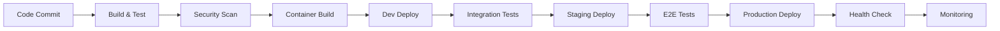

# CI/CD Pipeline Specifications

## Overview
This document provides comprehensive CI/CD pipeline specifications for the D&D AI Campaign Management System. It covers automated build, test, security scanning, deployment, and monitoring workflows using GitHub Actions, Azure DevOps, and GitOps practices with ArgoCD.

## Pipeline Architecture

### Multi-Stage Pipeline Strategy


### Pipeline Environments
1. **Development** - Automatic deployment on feature branch merge
2. **Staging** - Manual promotion with full test suite
3. **Production** - Manual approval with blue-green deployment
4. **Hotfix** - Fast-track pipeline for critical fixes

## GitHub Actions Workflows

### Main CI/CD Workflow
```yaml
# .github/workflows/ci-cd.yml
name: CI/CD Pipeline

on:
  push:
    branches: [main, develop]
    tags: [v*]
  pull_request:
    branches: [main, develop]

env:
  REGISTRY: ghcr.io
  IMAGE_NAME: ${{ github.repository }}
  DOTNET_VERSION: '8.0.x'
  NODE_VERSION: '18'
  FLUTTER_VERSION: '3.16.0'

jobs:
  # Code Quality and Testing
  code-quality:
    name: Code Quality & Unit Tests
    runs-on: ubuntu-latest
    strategy:
      matrix:
        service: [
          'src/Services/CampaignService',
          'src/Services/CharacterService', 
          'src/Services/NPCService',
          'src/Services/AuthService',
          'src/Services/AIGatewayService',
          'src/Services/RealtimeService',
          'src/Gateway/APIGateway'
        ]
    
    steps:
    - name: Checkout code
      uses: actions/checkout@v4
      with:
        fetch-depth: 0

    - name: Setup .NET
      uses: actions/setup-dotnet@v4
      with:
        dotnet-version: ${{ env.DOTNET_VERSION }}

    - name: Cache NuGet packages
      uses: actions/cache@v3
      with:
        path: ~/.nuget/packages
        key: ${{ runner.os }}-nuget-${{ hashFiles('**/*.csproj') }}
        restore-keys: |
          ${{ runner.os }}-nuget-

    - name: Restore dependencies
      run: dotnet restore ${{ matrix.service }}

    - name: Build
      run: dotnet build ${{ matrix.service }} --no-restore --configuration Release

    - name: Run unit tests
      run: |
        dotnet test ${{ matrix.service }}.UnitTests \
          --no-build \
          --configuration Release \
          --logger trx \
          --collect:"XPlat Code Coverage" \
          --results-directory ./TestResults

    - name: Upload test results
      uses: actions/upload-artifact@v3
      if: always()
      with:
        name: test-results-${{ matrix.service }}
        path: TestResults/

    - name: Code coverage
      uses: codecov/codecov-action@v3
      with:
        files: ./TestResults/*/coverage.cobertura.xml
        flags: ${{ matrix.service }}

  # Security Scanning
  security-scan:
    name: Security Scanning
    runs-on: ubuntu-latest
    needs: [code-quality]
    
    steps:
    - name: Checkout code
      uses: actions/checkout@v4
      with:
        fetch-depth: 0

    - name: Run Trivy vulnerability scanner
      uses: aquasecurity/trivy-action@master
      with:
        scan-type: 'fs'
        scan-ref: '.'
        format: 'sarif'
        output: 'trivy-results.sarif'

    - name: Upload Trivy scan results
      uses: github/codeql-action/upload-sarif@v2
      with:
        sarif_file: 'trivy-results.sarif'

    - name: .NET Security Scan
      run: |
        dotnet tool install --global security-scan
        security-scan --project-path . --output security-report.json

    - name: OWASP Dependency Check
      uses: dependency-check/Dependency-Check_Action@main
      with:
        project: 'D&D AI Campaign Manager'
        path: '.'
        format: 'ALL'
        out: 'dependency-check-reports'

    - name: Upload security reports
      uses: actions/upload-artifact@v3
      with:
        name: security-reports
        path: |
          trivy-results.sarif
          security-report.json
          dependency-check-reports/

  # Flutter Web App Build
  flutter-build:
    name: Flutter Web Build
    runs-on: ubuntu-latest
    
    steps:
    - name: Checkout code
      uses: actions/checkout@v4

    - name: Setup Flutter
      uses: subosito/flutter-action@v2
      with:
        flutter-version: ${{ env.FLUTTER_VERSION }}

    - name: Flutter dependencies
      run: |
        cd src/Client/Flutter
        flutter pub get

    - name: Flutter analyze
      run: |
        cd src/Client/Flutter
        flutter analyze

    - name: Flutter test
      run: |
        cd src/Client/Flutter
        flutter test --coverage

    - name: Flutter build web
      run: |
        cd src/Client/Flutter
        flutter build web --release --web-renderer html

    - name: Upload Flutter artifacts
      uses: actions/upload-artifact@v3
      with:
        name: flutter-web-build
        path: src/Client/Flutter/build/web/

  # Container Build and Push
  container-build:
    name: Build and Push Containers
    runs-on: ubuntu-latest
    needs: [code-quality, security-scan, flutter-build]
    if: github.event_name != 'pull_request'
    
    strategy:
      matrix:
        service: [
          { name: 'api-gateway', path: 'src/Gateway/APIGateway' },
          { name: 'campaign-service', path: 'src/Services/CampaignService' },
          { name: 'character-service', path: 'src/Services/CharacterService' },
          { name: 'npc-service', path: 'src/Services/NPCService' },
          { name: 'auth-service', path: 'src/Services/AuthService' },
          { name: 'ai-gateway-service', path: 'src/Services/AIGatewayService' },
          { name: 'realtime-service', path: 'src/Services/RealtimeService' },
          { name: 'web-app', path: 'src/Client/Flutter' }
        ]
    
    steps:
    - name: Checkout code
      uses: actions/checkout@v4

    - name: Setup Docker Buildx
      uses: docker/setup-buildx-action@v3

    - name: Log in to Container Registry
      uses: docker/login-action@v3
      with:
        registry: ${{ env.REGISTRY }}
        username: ${{ github.actor }}
        password: ${{ secrets.GITHUB_TOKEN }}

    - name: Extract metadata
      id: meta
      uses: docker/metadata-action@v5
      with:
        images: ${{ env.REGISTRY }}/dndai/${{ matrix.service.name }}
        tags: |
          type=ref,event=branch
          type=ref,event=pr
          type=sha,prefix={{branch}}-
          type=raw,value=latest,enable={{is_default_branch}}
          type=semver,pattern={{version}}
          type=semver,pattern={{major}}.{{minor}}

    - name: Download Flutter build (for web-app)
      if: matrix.service.name == 'web-app'
      uses: actions/download-artifact@v3
      with:
        name: flutter-web-build
        path: src/Client/Flutter/build/web/

    - name: Build and push container
      uses: docker/build-push-action@v5
      with:
        context: .
        file: ${{ matrix.service.path }}/Dockerfile
        platforms: linux/amd64,linux/arm64
        push: true
        tags: ${{ steps.meta.outputs.tags }}
        labels: ${{ steps.meta.outputs.labels }}
        cache-from: type=gha
        cache-to: type=gha,mode=max
        build-args: |
          BUILD_CONFIGURATION=Release
          BUILD_VERSION=${{ github.sha }}

    - name: Container security scan
      uses: aquasecurity/trivy-action@master
      with:
        image-ref: ${{ env.REGISTRY }}/dndai/${{ matrix.service.name }}:${{ github.sha }}
        format: 'sarif'
        output: 'container-${{ matrix.service.name }}-trivy.sarif'

    - name: Upload container scan results
      uses: github/codeql-action/upload-sarif@v2
      if: always()
      with:
        sarif_file: 'container-${{ matrix.service.name }}-trivy.sarif'

  # Integration Tests
  integration-tests:
    name: Integration Tests
    runs-on: ubuntu-latest
    needs: [container-build]
    if: github.event_name != 'pull_request'
    
    services:
      postgres:
        image: postgres:16-alpine
        env:
          POSTGRES_DB: dndai_test
          POSTGRES_USER: test_user
          POSTGRES_PASSWORD: test_password
        options: >-
          --health-cmd pg_isready
          --health-interval 10s
          --health-timeout 5s
          --health-retries 5
        ports:
          - 5432:5432
          
      redis:
        image: redis:7-alpine
        options: >-
          --health-cmd "redis-cli ping"
          --health-interval 10s
          --health-timeout 5s
          --health-retries 5
        ports:
          - 6379:6379

    steps:
    - name: Checkout code
      uses: actions/checkout@v4

    - name: Setup .NET
      uses: actions/setup-dotnet@v4
      with:
        dotnet-version: ${{ env.DOTNET_VERSION }}

    - name: Run integration tests
      env:
        ConnectionStrings__DefaultConnection: "Host=localhost;Database=dndai_test;Username=test_user;Password=test_password"
        Redis__ConnectionString: "localhost:6379"
      run: |
        dotnet test tests/IntegrationTests/ \
          --configuration Release \
          --logger trx \
          --collect:"XPlat Code Coverage" \
          --results-directory ./IntegrationTestResults

    - name: Upload integration test results
      uses: actions/upload-artifact@v3
      if: always()
      with:
        name: integration-test-results
        path: IntegrationTestResults/

  # Deploy to Development
  deploy-dev:
    name: Deploy to Development
    runs-on: ubuntu-latest
    needs: [integration-tests]
    if: github.ref == 'refs/heads/develop'
    environment: development
    
    steps:
    - name: Checkout code
      uses: actions/checkout@v4

    - name: Setup Kubectl
      uses: azure/setup-kubectl@v3
      with:
        version: 'latest'

    - name: Setup Helm
      uses: azure/setup-helm@v3
      with:
        version: 'latest'

    - name: Configure Kubernetes context
      uses: azure/k8s-set-context@v3
      with:
        method: kubeconfig
        kubeconfig: ${{ secrets.KUBE_CONFIG_DEV }}

    - name: Deploy to development
      run: |
        helm upgrade --install dndai-dev ./charts/dndai-platform \
          --namespace dndai-dev \
          --create-namespace \
          --values ./charts/dndai-platform/values-dev.yaml \
          --set global.imageTag=${{ github.sha }} \
          --wait \
          --timeout 10m

    - name: Run smoke tests
      run: |
        kubectl run smoke-test-${{ github.run_number }} \
          --image=curlimages/curl:latest \
          --rm -i --restart=Never \
          --namespace dndai-dev \
          -- curl -f http://api-gateway.dndai-dev.svc.cluster.local/health

  # Deploy to Staging
  deploy-staging:
    name: Deploy to Staging
    runs-on: ubuntu-latest
    needs: [deploy-dev]
    if: github.ref == 'refs/heads/main'
    environment: staging
    
    steps:
    - name: Checkout code
      uses: actions/checkout@v4

    - name: Setup Kubectl
      uses: azure/setup-kubectl@v3

    - name: Setup Helm
      uses: azure/setup-helm@v3

    - name: Configure Kubernetes context
      uses: azure/k8s-set-context@v3
      with:
        method: kubeconfig
        kubeconfig: ${{ secrets.KUBE_CONFIG_STAGING }}

    - name: Deploy to staging
      run: |
        helm upgrade --install dndai-staging ./charts/dndai-platform \
          --namespace dndai-staging \
          --create-namespace \
          --values ./charts/dndai-platform/values-staging.yaml \
          --set global.imageTag=${{ github.sha }} \
          --wait \
          --timeout 15m

    - name: Run E2E tests
      run: |
        # Run comprehensive E2E test suite
        docker run --rm \
          -e API_BASE_URL=https://api-staging.dndai.app \
          -e WEB_BASE_URL=https://app-staging.dndai.app \
          dndai/e2e-tests:latest

  # Deploy to Production
  deploy-production:
    name: Deploy to Production
    runs-on: ubuntu-latest
    needs: [deploy-staging]
    if: startsWith(github.ref, 'refs/tags/v')
    environment: production
    
    steps:
    - name: Checkout code
      uses: actions/checkout@v4

    - name: Setup Kubectl
      uses: azure/setup-kubectl@v3

    - name: Setup Helm
      uses: azure/setup-helm@v3

    - name: Configure Kubernetes context
      uses: azure/k8s-set-context@v3
      with:
        method: kubeconfig
        kubeconfig: ${{ secrets.KUBE_CONFIG_PROD }}

    - name: Blue-Green Deployment
      run: |
        # Get current version
        CURRENT_VERSION=$(helm get values dndai-prod -n dndai-services -o json | jq -r '.global.imageTag // "none"')
        
        # Deploy green version
        helm upgrade --install dndai-prod-green ./charts/dndai-platform \
          --namespace dndai-services-green \
          --create-namespace \
          --values ./charts/dndai-platform/values-prod.yaml \
          --set global.imageTag=${{ github.ref_name }} \
          --set nameOverride="dndai-green" \
          --wait \
          --timeout 20m

        # Health check green deployment
        kubectl wait --for=condition=available deployment --all -n dndai-services-green --timeout=600s
        
        # Run production smoke tests
        kubectl run prod-smoke-test-${{ github.run_number }} \
          --image=dndai/smoke-tests:latest \
          --rm -i --restart=Never \
          --namespace dndai-services-green \
          --env="API_URL=http://api-gateway-green.dndai-services-green.svc.cluster.local"

    - name: Switch Traffic (Blue-Green)
      run: |
        # Update ingress to point to green deployment
        kubectl patch ingress dndai-ingress -n dndai-services \
          --type='json' \
          -p='[{"op": "replace", "path": "/spec/rules/0/http/paths/0/backend/service/name", "value": "api-gateway-green"}]'
        
        # Wait for traffic switch
        sleep 30
        
        # Verify production health
        curl -f https://api.dndai.app/health

    - name: Cleanup Old Version
      run: |
        # Remove old blue deployment after successful green deployment
        helm uninstall dndai-prod -n dndai-services --ignore-not-found
        kubectl delete namespace dndai-services --ignore-not-found
        
        # Rename green to production
        kubectl create namespace dndai-services
        kubectl get all -n dndai-services-green -o yaml | \
          sed 's/dndai-services-green/dndai-services/g' | \
          kubectl apply -f -
        kubectl delete namespace dndai-services-green

    - name: Create GitHub Release
      uses: actions/create-release@v1
      env:
        GITHUB_TOKEN: ${{ secrets.GITHUB_TOKEN }}
      with:
        tag_name: ${{ github.ref_name }}
        release_name: Release ${{ github.ref_name }}
        draft: false
        prerelease: false

  # Rollback Workflow
  rollback:
    name: Production Rollback
    runs-on: ubuntu-latest
    if: github.event_name == 'workflow_dispatch'
    environment: production
    
    steps:
    - name: Setup Kubectl
      uses: azure/setup-kubectl@v3

    - name: Setup Helm
      uses: azure/setup-helm@v3

    - name: Configure Kubernetes context
      uses: azure/k8s-set-context@v3
      with:
        method: kubeconfig
        kubeconfig: ${{ secrets.KUBE_CONFIG_PROD }}

    - name: Rollback to previous version
      run: |
        helm rollback dndai-prod -n dndai-services
        kubectl wait --for=condition=available deployment --all -n dndai-services --timeout=600s
        
    - name: Verify rollback
      run: |
        curl -f https://api.dndai.app/health
        echo "Rollback completed successfully"
```

### Database Migration Workflow
```yaml
# .github/workflows/database-migration.yml
name: Database Migration

on:
  workflow_dispatch:
    inputs:
      environment:
        description: 'Target environment'
        required: true
        default: 'development'
        type: choice
        options:
          - development
          - staging
          - production
      migration_action:
        description: 'Migration action'
        required: true
        default: 'upgrade'
        type: choice
        options:
          - upgrade
          - rollback
          - status

jobs:
  database-migration:
    name: Database Migration
    runs-on: ubuntu-latest
    environment: ${{ github.event.inputs.environment }}
    
    steps:
    - name: Checkout code
      uses: actions/checkout@v4

    - name: Setup .NET
      uses: actions/setup-dotnet@v4
      with:
        dotnet-version: '8.0.x'

    - name: Install EF Core Tools
      run: dotnet tool install --global dotnet-ef

    - name: Set connection string
      run: |
        case "${{ github.event.inputs.environment }}" in
          development)
            echo "CONNECTION_STRING=${{ secrets.DB_CONNECTION_DEV }}" >> $GITHUB_ENV
            ;;
          staging)
            echo "CONNECTION_STRING=${{ secrets.DB_CONNECTION_STAGING }}" >> $GITHUB_ENV
            ;;
          production)
            echo "CONNECTION_STRING=${{ secrets.DB_CONNECTION_PROD }}" >> $GITHUB_ENV
            ;;
        esac

    - name: Database Migration Status
      if: github.event.inputs.migration_action == 'status'
      run: |
        cd src/Services/CampaignService
        dotnet ef database update --connection "$CONNECTION_STRING" --dry-run

    - name: Database Migration Upgrade
      if: github.event.inputs.migration_action == 'upgrade'
      run: |
        cd src/Services/CampaignService
        dotnet ef database update --connection "$CONNECTION_STRING"

    - name: Database Migration Rollback
      if: github.event.inputs.migration_action == 'rollback'
      run: |
        cd src/Services/CampaignService
        # Rollback to previous migration (implement specific rollback logic)
        dotnet ef database update PreviousMigration --connection "$CONNECTION_STRING"

    - name: Verify Migration
      run: |
        cd src/Services/CampaignService
        dotnet ef migrations list --connection "$CONNECTION_STRING"
```

## Azure DevOps Pipelines (Alternative)

### Azure Pipeline YAML
```yaml
# azure-pipelines.yml
trigger:
  branches:
    include:
    - main
    - develop
  tags:
    include:
    - v*

pr:
  branches:
    include:
    - main
    - develop

variables:
  buildConfiguration: 'Release'
  vmImageName: 'ubuntu-latest'
  containerRegistry: 'dndai.azurecr.io'
  
stages:
- stage: Build
  displayName: Build and Test
  jobs:
  - job: BuildAndTest
    displayName: Build and Test Services
    pool:
      vmImage: $(vmImageName)
    
    strategy:
      matrix:
        CampaignService:
          servicePath: 'src/Services/CampaignService'
          serviceName: 'campaign-service'
        CharacterService:
          servicePath: 'src/Services/CharacterService'
          serviceName: 'character-service'
        NPCService:
          servicePath: 'src/Services/NPCService'
          serviceName: 'npc-service'
        AuthService:
          servicePath: 'src/Services/AuthService'
          serviceName: 'auth-service'
        AIGatewayService:
          servicePath: 'src/Services/AIGatewayService'
          serviceName: 'ai-gateway-service'
        RealtimeService:
          servicePath: 'src/Services/RealtimeService'
          serviceName: 'realtime-service'
        APIGateway:
          servicePath: 'src/Gateway/APIGateway'
          serviceName: 'api-gateway'
    
    steps:
    - task: UseDotNet@2
      displayName: 'Use .NET 8'
      inputs:
        packageType: 'sdk'
        version: '8.0.x'

    - task: DotNetCoreCLI@2
      displayName: 'Restore packages'
      inputs:
        command: 'restore'
        projects: '$(servicePath)/**/*.csproj'

    - task: DotNetCoreCLI@2
      displayName: 'Build $(serviceName)'
      inputs:
        command: 'build'
        projects: '$(servicePath)/**/*.csproj'
        arguments: '--configuration $(buildConfiguration) --no-restore'

    - task: DotNetCoreCLI@2
      displayName: 'Run unit tests'
      inputs:
        command: 'test'
        projects: '$(servicePath).UnitTests/*.csproj'
        arguments: '--configuration $(buildConfiguration) --no-build --collect:"XPlat Code Coverage" --logger trx'
        publishTestResults: true

    - task: PublishCodeCoverageResults@1
      displayName: 'Publish code coverage'
      inputs:
        codeCoverageTool: 'Cobertura'
        summaryFileLocation: '$(Agent.TempDirectory)/**/coverage.cobertura.xml'

- stage: Security
  displayName: Security Scanning
  dependsOn: Build
  jobs:
  - job: SecurityScan
    displayName: Security Scanning
    pool:
      vmImage: $(vmImageName)
    
    steps:
    - task: WhiteSource@21
      displayName: 'WhiteSource Security Scan'
      inputs:
        cwd: '$(System.DefaultWorkingDirectory)'

    - task: CredScan@3
      displayName: 'Credential Scanner'

    - task: SdtReport@2
      displayName: 'Security Analysis Report'
      inputs:
        GdnExportAllTools: false
        GdnExportGdnToolWhiteSource: true
        GdnExportGdnToolCredScan: true

- stage: ContainerBuild
  displayName: Build Containers
  dependsOn: [Build, Security]
  condition: and(succeeded(), ne(variables['Build.Reason'], 'PullRequest'))
  jobs:
  - job: BuildContainers
    displayName: Build and Push Containers
    pool:
      vmImage: $(vmImageName)
    
    strategy:
      matrix:
        CampaignService:
          servicePath: 'src/Services/CampaignService'
          serviceName: 'campaign-service'
        CharacterService:
          servicePath: 'src/Services/CharacterService'
          serviceName: 'character-service'
        NPCService:
          servicePath: 'src/Services/NPCService'
          serviceName: 'npc-service'
        AuthService:
          servicePath: 'src/Services/AuthService'
          serviceName: 'auth-service'
        AIGatewayService:
          servicePath: 'src/Services/AIGatewayService'
          serviceName: 'ai-gateway-service'
        RealtimeService:
          servicePath: 'src/Services/RealtimeService'
          serviceName: 'realtime-service'
        APIGateway:
          servicePath: 'src/Gateway/APIGateway'
          serviceName: 'api-gateway'
    
    steps:
    - task: Docker@2
      displayName: 'Build container image'
      inputs:
        command: 'build'
        repository: '$(serviceName)'
        dockerfile: '$(servicePath)/Dockerfile'
        containerRegistry: '$(containerRegistry)'
        tags: |
          $(Build.BuildId)
          latest

    - task: Docker@2
      displayName: 'Push container image'
      inputs:
        command: 'push'
        repository: '$(serviceName)'
        containerRegistry: '$(containerRegistry)'
        tags: |
          $(Build.BuildId)
          latest

- stage: DeployDev
  displayName: Deploy to Development
  dependsOn: ContainerBuild
  condition: and(succeeded(), eq(variables['Build.SourceBranch'], 'refs/heads/develop'))
  jobs:
  - deployment: DeployToDev
    displayName: Deploy to Development
    pool:
      vmImage: $(vmImageName)
    environment: 'development'
    strategy:
      runOnce:
        deploy:
          steps:
          - task: HelmDeploy@0
            displayName: 'Deploy with Helm'
            inputs:
              connectionType: 'Kubernetes Service Connection'
              kubernetesServiceConnection: 'k8s-dev'
              namespace: 'dndai-dev'
              command: 'upgrade'
              chartType: 'FilePath'
              chartPath: '$(Pipeline.Workspace)/charts/dndai-platform'
              releaseName: 'dndai-dev'
              valueFile: '$(Pipeline.Workspace)/charts/dndai-platform/values-dev.yaml'
              overrideValues: 'global.imageTag=$(Build.BuildId)'

- stage: DeployStaging
  displayName: Deploy to Staging
  dependsOn: DeployDev
  condition: and(succeeded(), eq(variables['Build.SourceBranch'], 'refs/heads/main'))
  jobs:
  - deployment: DeployToStaging
    displayName: Deploy to Staging
    pool:
      vmImage: $(vmImageName)
    environment: 'staging'
    strategy:
      runOnce:
        deploy:
          steps:
          - task: HelmDeploy@0
            displayName: 'Deploy with Helm'
            inputs:
              connectionType: 'Kubernetes Service Connection'
              kubernetesServiceConnection: 'k8s-staging'
              namespace: 'dndai-staging'
              command: 'upgrade'
              chartType: 'FilePath'
              chartPath: '$(Pipeline.Workspace)/charts/dndai-platform'
              releaseName: 'dndai-staging'
              valueFile: '$(Pipeline.Workspace)/charts/dndai-platform/values-staging.yaml'
              overrideValues: 'global.imageTag=$(Build.BuildId)'

- stage: DeployProduction
  displayName: Deploy to Production
  dependsOn: DeployStaging
  condition: and(succeeded(), startsWith(variables['Build.SourceBranch'], 'refs/tags/v'))
  jobs:
  - deployment: DeployToProduction
    displayName: Deploy to Production
    pool:
      vmImage: $(vmImageName)
    environment: 'production'
    strategy:
      runOnce:
        deploy:
          steps:
          - task: HelmDeploy@0
            displayName: 'Blue-Green Deploy with Helm'
            inputs:
              connectionType: 'Kubernetes Service Connection'
              kubernetesServiceConnection: 'k8s-prod'
              namespace: 'dndai-services'
              command: 'upgrade'
              chartType: 'FilePath'
              chartPath: '$(Pipeline.Workspace)/charts/dndai-platform'
              releaseName: 'dndai-prod'
              valueFile: '$(Pipeline.Workspace)/charts/dndai-platform/values-prod.yaml'
              overrideValues: 'global.imageTag=$(Build.BuildId)'
```

## GitOps with ArgoCD

### ArgoCD Application of Applications
```yaml
# argocd/app-of-apps.yaml
apiVersion: argoproj.io/v1alpha1
kind: Application
metadata:
  name: dndai-app-of-apps
  namespace: argocd
  finalizers:
    - resources-finalizer.argocd.argoproj.io
spec:
  project: default
  source:
    repoURL: https://github.com/dndai/campaign-manager
    targetRevision: main
    path: argocd/applications
  destination:
    server: https://kubernetes.default.svc
    namespace: argocd
  syncPolicy:
    automated:
      prune: true
      selfHeal: true
    syncOptions:
      - CreateNamespace=true
```

### Environment-Specific ArgoCD Applications
```yaml
# argocd/applications/dndai-production.yaml
apiVersion: argoproj.io/v1alpha1
kind: Application
metadata:
  name: dndai-production
  namespace: argocd
spec:
  project: default
  source:
    repoURL: https://github.com/dndai/campaign-manager
    targetRevision: main
    path: charts/dndai-platform
    helm:
      valueFiles:
        - values-prod.yaml
      parameters:
        - name: global.imageTag
          value: "v1.0.0"
  destination:
    server: https://kubernetes.default.svc
    namespace: dndai-services
  syncPolicy:
    automated:
      prune: true
      selfHeal: false  # Manual sync for production
    syncOptions:
      - CreateNamespace=true
      - RespectIgnoreDifferences=true
    retry:
      limit: 3
      backoff:
        duration: 5s
        factor: 2
        maxDuration: 3m
  ignoreDifferences:
  - group: apps
    kind: Deployment
    jsonPointers:
    - /spec/replicas  # Ignore HPA-managed replica counts
```

## Monitoring and Alerting Pipeline

### Pipeline Monitoring
```yaml
# .github/workflows/pipeline-monitoring.yml
name: Pipeline Monitoring

on:
  workflow_run:
    workflows: ["CI/CD Pipeline"]
    types: [completed]

jobs:
  pipeline-metrics:
    runs-on: ubuntu-latest
    steps:
    - name: Send metrics to monitoring
      run: |
        # Send pipeline metrics to Prometheus/Grafana
        curl -X POST https://monitoring.dndai.app/api/metrics \
          -H "Authorization: Bearer ${{ secrets.MONITORING_TOKEN }}" \
          -d '{
            "pipeline_duration": "${{ github.event.workflow_run.run_duration }}",
            "pipeline_status": "${{ github.event.workflow_run.conclusion }}",
            "pipeline_name": "${{ github.event.workflow_run.name }}",
            "commit_sha": "${{ github.event.workflow_run.head_sha }}"
          }'

    - name: Alert on failure
      if: github.event.workflow_run.conclusion == 'failure'
      uses: 8398a7/action-slack@v3
      with:
        status: failure
        webhook_url: ${{ secrets.SLACK_WEBHOOK }}
        text: |
          🚨 Pipeline Failed: ${{ github.event.workflow_run.name }}
          Branch: ${{ github.event.workflow_run.head_branch }}
          Commit: ${{ github.event.workflow_run.head_sha }}
          Duration: ${{ github.event.workflow_run.run_duration }}s
```

## Pipeline Configuration Files

### Dependabot Configuration
```yaml
# .github/dependabot.yml
version: 2
updates:
  # .NET dependencies
  - package-ecosystem: "nuget"
    directory: "/"
    schedule:
      interval: "weekly"
    open-pull-requests-limit: 10
    reviewers:
      - "dndai/backend-team"
    
  # Flutter dependencies
  - package-ecosystem: "pub"
    directory: "/src/Client/Flutter"
    schedule:
      interval: "weekly"
    reviewers:
      - "dndai/frontend-team"
    
  # Docker dependencies
  - package-ecosystem: "docker"
    directory: "/"
    schedule:
      interval: "weekly"
    reviewers:
      - "dndai/devops-team"
    
  # GitHub Actions
  - package-ecosystem: "github-actions"
    directory: "/"
    schedule:
      interval: "weekly"
    reviewers:
      - "dndai/devops-team"
```

### Code Quality Configuration
```yaml
# .github/workflows/code-quality.yml
name: Code Quality

on:
  pull_request:
    branches: [main, develop]

jobs:
  sonarcloud:
    name: SonarCloud Analysis
    runs-on: ubuntu-latest
    steps:
    - uses: actions/checkout@v4
      with:
        fetch-depth: 0

    - name: Setup .NET
      uses: actions/setup-dotnet@v4
      with:
        dotnet-version: '8.0.x'

    - name: Cache SonarCloud packages
      uses: actions/cache@v3
      with:
        path: ~/.sonar/cache
        key: ${{ runner.os }}-sonar
        restore-keys: ${{ runner.os }}-sonar

    - name: Install SonarCloud scanner
      run: |
        dotnet tool install --global dotnet-sonarscanner

    - name: Build and analyze
      env:
        GITHUB_TOKEN: ${{ secrets.GITHUB_TOKEN }}
        SONAR_TOKEN: ${{ secrets.SONAR_TOKEN }}
      run: |
        dotnet sonarscanner begin /k:"dndai_campaign-manager" /o:"dndai" /d:sonar.login="${{ secrets.SONAR_TOKEN }}" /d:sonar.host.url="https://sonarcloud.io"
        dotnet build --configuration Release
        dotnet sonarscanner end /d:sonar.login="${{ secrets.SONAR_TOKEN }}"
```

This CI/CD Pipeline specification provides:

1. **Comprehensive Build Pipeline** - Multi-stage builds with testing, security scanning
2. **Container Management** - Automated container builds with security scanning
3. **Environment Promotion** - Dev → Staging → Production with approvals
4. **Blue-Green Deployment** - Zero-downtime production deployments
5. **Database Migrations** - Automated and manual migration workflows
6. **Security Integration** - Vulnerability scanning, dependency checks, credential scanning
7. **GitOps Support** - ArgoCD integration for declarative deployments
8. **Monitoring Integration** - Pipeline metrics and alerting
9. **Code Quality** - SonarCloud analysis, code coverage reporting
10. **Rollback Capabilities** - Automated rollback procedures for production

The pipeline ensures reliable, secure, and automated deployments while maintaining high code quality and operational visibility.

Would you like me to continue with the Monitoring and Observability specifications next?
