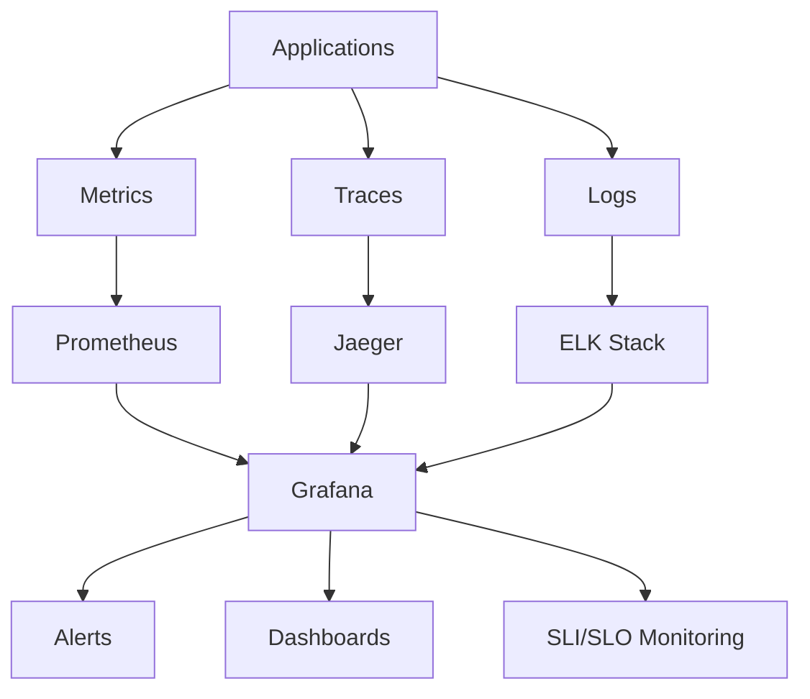

# Monitoring and Observability Specifications

## Overview
This document provides comprehensive monitoring and observability specifications for the D&D AI Campaign Management System. It covers metrics collection, distributed tracing, logging, alerting, dashboards, and SLI/SLO definitions that ensure operational visibility, performance monitoring, and proactive issue detection across the entire microservices architecture.

## Observability Architecture

### Three Pillars of Observability


### Monitoring Stack Components
- **Metrics**: Prometheus + Grafana
- **Distributed Tracing**: Jaeger with OpenTelemetry
- **Logging**: Elasticsearch + Logstash + Kibana (ELK)
- **Alerting**: Prometheus Alertmanager + Slack/PagerDuty
- **APM**: Application Performance Monitoring with custom dashboards
- **Synthetic Monitoring**: Uptime monitoring and health checks

## Prometheus Metrics Configuration

### Prometheus Server Configuration
```yaml
# monitoring/prometheus/prometheus.yml
global:
  scrape_interval: 15s
  evaluation_interval: 15s
  external_labels:
    cluster: 'dndai-production'
    environment: 'production'

rule_files:
  - "/etc/prometheus/rules/*.yml"

alerting:
  alertmanagers:
    - static_configs:
        - targets:
          - alertmanager:9093

scrape_configs:
  # Kubernetes API Server
  - job_name: 'kubernetes-apiservers'
    kubernetes_sd_configs:
    - role: endpoints
    scheme: https
    tls_config:
      ca_file: /var/run/secrets/kubernetes.io/serviceaccount/ca.crt
    bearer_token_file: /var/run/secrets/kubernetes.io/serviceaccount/token
    relabel_configs:
    - source_labels: [__meta_kubernetes_namespace, __meta_kubernetes_service_name, __meta_kubernetes_endpoint_port_name]
      action: keep
      regex: default;kubernetes;https

  # Kubernetes Nodes
  - job_name: 'kubernetes-nodes'
    kubernetes_sd_configs:
    - role: node
    scheme: https
    tls_config:
      ca_file: /var/run/secrets/kubernetes.io/serviceaccount/ca.crt
    bearer_token_file: /var/run/secrets/kubernetes.io/serviceaccount/token
    relabel_configs:
    - action: labelmap
      regex: __meta_kubernetes_node_label_(.+)
    - target_label: __address__
      replacement: kubernetes.default.svc:443
    - source_labels: [__meta_kubernetes_node_name]
      regex: (.+)
      target_label: __metrics_path__
      replacement: /api/v1/nodes/${1}/proxy/metrics

  # Kubernetes Pods
  - job_name: 'kubernetes-pods'
    kubernetes_sd_configs:
    - role: pod
    relabel_configs:
    - source_labels: [__meta_kubernetes_pod_annotation_prometheus_io_scrape]
      action: keep
      regex: true
    - source_labels: [__meta_kubernetes_pod_annotation_prometheus_io_path]
      action: replace
      target_label: __metrics_path__
      regex: (.+)
    - source_labels: [__address__, __meta_kubernetes_pod_annotation_prometheus_io_port]
      action: replace
      regex: ([^:]+)(?::\d+)?;(\d+)
      replacement: $1:$2
      target_label: __address__
    - action: labelmap
      regex: __meta_kubernetes_pod_label_(.+)
    - source_labels: [__meta_kubernetes_namespace]
      action: replace
      target_label: kubernetes_namespace
    - source_labels: [__meta_kubernetes_pod_name]
      action: replace
      target_label: kubernetes_pod_name

  # D&D AI Services
  - job_name: 'dndai-services'
    kubernetes_sd_configs:
    - role: endpoints
      namespaces:
        names:
        - dndai-services
    relabel_configs:
    - source_labels: [__meta_kubernetes_service_annotation_prometheus_io_scrape]
      action: keep
      regex: true
    - source_labels: [__meta_kubernetes_service_annotation_prometheus_io_scheme]
      action: replace
      target_label: __scheme__
      regex: (https?)
    - source_labels: [__meta_kubernetes_service_annotation_prometheus_io_path]
      action: replace
      target_label: __metrics_path__
      regex: (.+)
    - source_labels: [__address__, __meta_kubernetes_service_annotation_prometheus_io_port]
      action: replace
      target_label: __address__
      regex: ([^:]+)(?::\d+)?;(\d+)
      replacement: $1:$2
    - action: labelmap
      regex: __meta_kubernetes_service_label_(.+)
    - source_labels: [__meta_kubernetes_namespace]
      action: replace
      target_label: kubernetes_namespace
    - source_labels: [__meta_kubernetes_service_name]
      action: replace
      target_label: kubernetes_name

  # PostgreSQL
  - job_name: 'postgresql'
    static_configs:
    - targets: ['postgres-exporter.dndai-data.svc.cluster.local:9187']
    scrape_interval: 30s

  # Redis
  - job_name: 'redis'
    static_configs:
    - targets: ['redis-exporter.dndai-data.svc.cluster.local:9121']
    scrape_interval: 30s

  # NGINX Ingress
  - job_name: 'nginx-ingress'
    kubernetes_sd_configs:
    - role: pod
      namespaces:
        names:
        - ingress-nginx
    relabel_configs:
    - source_labels: [__meta_kubernetes_pod_label_app_kubernetes_io_name]
      action: keep
      regex: ingress-nginx
    - source_labels: [__meta_kubernetes_pod_label_app_kubernetes_io_component]
      action: keep
      regex: controller
    - source_labels: [__address__]
      action: replace
      regex: ([^:]+)(?::\d+)?
      replacement: $1:10254
      target_label: __address__
```

### Custom Application Metrics
```csharp
// Shared/DnDAI.Shared.Kernel/Metrics/ApplicationMetrics.cs
using System.Diagnostics.Metrics;
using Prometheus;

namespace DnDAI.Shared.Kernel.Metrics
{
    public static class ApplicationMetrics
    {
        private static readonly Meter Meter = new("DnDAI.Application", "1.0.0");
        
        // HTTP Request Metrics
        public static readonly Counter<long> HttpRequestsTotal = Meter.CreateCounter<long>(
            "http_requests_total",
            "Total number of HTTP requests");
            
        public static readonly Histogram<double> HttpRequestDuration = Meter.CreateHistogram<double>(
            "http_request_duration_seconds",
            "Duration of HTTP requests in seconds");
            
        // Business Metrics
        public static readonly Counter<long> CampaignsCreated = Meter.CreateCounter<long>(
            "campaigns_created_total",
            "Total number of campaigns created");
            
        public static readonly Counter<long> CharactersCreated = Meter.CreateCounter<long>(
            "characters_created_total",
            "Total number of characters created");
            
        public static readonly Counter<long> NPCsGenerated = Meter.CreateCounter<long>(
            "npcs_generated_total",
            "Total number of NPCs generated");
            
        public static readonly Counter<long> AIRequestsTotal = Meter.CreateCounter<long>(
            "ai_requests_total",
            "Total number of AI requests");
            
        public static readonly Histogram<double> AIRequestDuration = Meter.CreateHistogram<double>(
            "ai_request_duration_seconds",
            "Duration of AI requests in seconds");
            
        public static readonly Counter<long> AITokensUsed = Meter.CreateCounter<long>(
            "ai_tokens_used_total",
            "Total number of AI tokens consumed");
            
        // Real-time Metrics
        public static readonly Gauge<int> ActiveSessions = Meter.CreateGauge<int>(
            "active_sessions",
            "Number of active gaming sessions");
            
        public static readonly Gauge<int> ConnectedUsers = Meter.CreateGauge<int>(
            "connected_users",
            "Number of connected users");
            
        public static readonly Counter<long> DiceRollsTotal = Meter.CreateCounter<long>(
            "dice_rolls_total",
            "Total number of dice rolls");
            
        public static readonly Counter<long> ChatMessagesTotal = Meter.CreateCounter<long>(
            "chat_messages_total",
            "Total number of chat messages");
            
        // Database Metrics
        public static readonly Histogram<double> DatabaseQueryDuration = Meter.CreateHistogram<double>(
            "database_query_duration_seconds",
            "Duration of database queries in seconds");
            
        public static readonly Counter<long> DatabaseQueriesTotal = Meter.CreateCounter<long>(
            "database_queries_total",
            "Total number of database queries");
            
        // Cache Metrics
        public static readonly Counter<long> CacheHitsTotal = Meter.CreateCounter<long>(
            "cache_hits_total",
            "Total number of cache hits");
            
        public static readonly Counter<long> CacheMissesTotal = Meter.CreateCounter<long>(
            "cache_misses_total",
            "Total number of cache misses");
            
        // Error Metrics
        public static readonly Counter<long> ErrorsTotal = Meter.CreateCounter<long>(
            "errors_total",
            "Total number of errors");
            
        public static readonly Counter<long> ExceptionsTotal = Meter.CreateCounter<long>(
            "exceptions_total",
            "Total number of unhandled exceptions");
    }
}
```

### Prometheus Recording Rules
```yaml
# monitoring/prometheus/rules/application-rules.yml
groups:
- name: dndai.application.rules
  interval: 30s
  rules:
  # HTTP Request Rate
  - record: dndai:http_request_rate
    expr: rate(http_requests_total[5m])
    
  # HTTP Error Rate
  - record: dndai:http_error_rate
    expr: rate(http_requests_total{status=~"5.."}[5m]) / rate(http_requests_total[5m])
    
  # HTTP 99th Percentile Latency
  - record: dndai:http_request_duration_99p
    expr: histogram_quantile(0.99, rate(http_request_duration_seconds_bucket[5m]))
    
  # AI Request Success Rate
  - record: dndai:ai_success_rate
    expr: rate(ai_requests_total{status="success"}[5m]) / rate(ai_requests_total[5m])
    
  # AI Token Usage Rate
  - record: dndai:ai_token_rate
    expr: rate(ai_tokens_used_total[5m])
    
  # Database Connection Pool Usage
  - record: dndai:db_connection_usage
    expr: database_connections_active / database_connections_max
    
  # Cache Hit Rate
  - record: dndai:cache_hit_rate
    expr: rate(cache_hits_total[5m]) / (rate(cache_hits_total[5m]) + rate(cache_misses_total[5m]))
    
  # Active User Ratio
  - record: dndai:active_user_ratio
    expr: connected_users / active_sessions
```

## Distributed Tracing with Jaeger

### OpenTelemetry Configuration
```csharp
// Shared/DnDAI.Shared.Kernel/Tracing/TracingConfiguration.cs
using OpenTelemetry;
using OpenTelemetry.Trace;
using OpenTelemetry.Resources;

namespace DnDAI.Shared.Kernel.Tracing
{
    public static class TracingConfiguration
    {
        public static void ConfigureTracing(this IServiceCollection services, IConfiguration configuration)
        {
            services.AddOpenTelemetry()
                .WithTracing(builder =>
                {
                    builder
                        .SetResourceBuilder(ResourceBuilder.CreateDefault()
                            .AddService("dndai-service", "1.0.0")
                            .AddAttributes(new Dictionary<string, object>
                            {
                                ["deployment.environment"] = Environment.GetEnvironmentVariable("ASPNETCORE_ENVIRONMENT") ?? "production",
                                ["service.namespace"] = "dndai",
                                ["service.instance.id"] = Environment.MachineName
                            }))
                        .AddAspNetCoreInstrumentation(options =>
                        {
                            options.RecordException = true;
                            options.EnrichWithHttpRequest = (activity, request) =>
                            {
                                activity.SetTag("http.request.body.size", request.ContentLength);
                                activity.SetTag("user.id", request.HttpContext.User?.FindFirst("sub")?.Value);
                            };
                            options.EnrichWithHttpResponse = (activity, response) =>
                            {
                                activity.SetTag("http.response.body.size", response.ContentLength);
                            };
                        })
                        .AddHttpClientInstrumentation(options =>
                        {
                            options.RecordException = true;
                            options.EnrichWithHttpRequestMessage = (activity, request) =>
                            {
                                activity.SetTag("http.client.request.body.size", request.Content?.Headers?.ContentLength);
                            };
                            options.EnrichWithHttpResponseMessage = (activity, response) =>
                            {
                                activity.SetTag("http.client.response.body.size", response.Content?.Headers?.ContentLength);
                            };
                        })
                        .AddEntityFrameworkCoreInstrumentation(options =>
                        {
                            options.SetDbStatementForText = true;
                            options.SetDbStatementForStoredProcedure = true;
                            options.RecordException = true;
                        })
                        .AddRedisInstrumentation()
                        .AddSource("DnDAI.*")
                        .SetSampler(new TraceIdRatioBasedSampler(0.1)) // Sample 10% of traces
                        .AddJaegerExporter(options =>
                        {
                            options.AgentHost = configuration["Jaeger:AgentHost"] ?? "jaeger-agent";
                            options.AgentPort = int.Parse(configuration["Jaeger:AgentPort"] ?? "6831");
                        });
                });
        }
    }

    public static class CustomTracing
    {
        private static readonly ActivitySource ActivitySource = new("DnDAI.Application");

        public static Activity? StartActivity(string name, ActivityKind kind = ActivityKind.Internal)
        {
            return ActivitySource.StartActivity(name, kind);
        }

        public static void AddBusinessTags(this Activity? activity, string operation, string entityId, string? userId = null)
        {
            activity?.SetTag("business.operation", operation);
            activity?.SetTag("business.entity.id", entityId);
            if (userId != null)
                activity?.SetTag("business.user.id", userId);
        }

        public static void RecordAIRequest(this Activity? activity, string provider, string model, int tokenCount)
        {
            activity?.SetTag("ai.provider", provider);
            activity?.SetTag("ai.model", model);
            activity?.SetTag("ai.token.count", tokenCount);
        }
    }
}
```

### Jaeger Deployment
```yaml
# monitoring/jaeger/jaeger-deployment.yaml
apiVersion: apps/v1
kind: Deployment
metadata:
  name: jaeger
  namespace: dndai-monitoring
  labels:
    app: jaeger
spec:
  replicas: 1
  selector:
    matchLabels:
      app: jaeger
  template:
    metadata:
      labels:
        app: jaeger
    spec:
      containers:
      - name: jaeger
        image: jaegertracing/all-in-one:1.50
        ports:
        - containerPort: 16686
          name: ui
        - containerPort: 14268
          name: collector
        - containerPort: 6831
          name: agent-udp
          protocol: UDP
        - containerPort: 6832
          name: agent-binary
        env:
        - name: COLLECTOR_OTLP_ENABLED
          value: "true"
        - name: SPAN_STORAGE_TYPE
          value: "elasticsearch"
        - name: ES_SERVER_URLS
          value: "http://elasticsearch.dndai-monitoring.svc.cluster.local:9200"
        - name: ES_USERNAME
          valueFrom:
            secretKeyRef:
              name: elasticsearch-credentials
              key: username
        - name: ES_PASSWORD
          valueFrom:
            secretKeyRef:
              name: elasticsearch-credentials
              key: password
        resources:
          requests:
            memory: "512Mi"
            cpu: "250m"
          limits:
            memory: "1Gi"
            cpu: "500m"
        livenessProbe:
          httpGet:
            path: /
            port: 16686
          initialDelaySeconds: 30
          periodSeconds: 30
        readinessProbe:
          httpGet:
            path: /
            port: 16686
          initialDelaySeconds: 10
          periodSeconds: 10

---
apiVersion: v1
kind: Service
metadata:
  name: jaeger
  namespace: dndai-monitoring
  labels:
    app: jaeger
spec:
  selector:
    app: jaeger
  ports:
  - name: ui
    port: 16686
    targetPort: 16686
  - name: collector
    port: 14268
    targetPort: 14268
  - name: agent-udp
    port: 6831
    targetPort: 6831
    protocol: UDP
  - name: agent-binary
    port: 6832
    targetPort: 6832
```

## Centralized Logging with ELK Stack

### Elasticsearch Configuration
```yaml
# monitoring/elasticsearch/elasticsearch.yaml
apiVersion: elasticsearch.k8s.elastic.co/v1
kind: Elasticsearch
metadata:
  name: elasticsearch
  namespace: dndai-monitoring
spec:
  version: 8.10.0
  nodeSets:
  - name: default
    count: 3
    config:
      node.store.allow_mmap: false
      xpack.security.enabled: true
      xpack.security.transport.ssl.enabled: true
      xpack.security.http.ssl.enabled: true
      xpack.monitoring.collection.enabled: true
    podTemplate:
      spec:
        containers:
        - name: elasticsearch
          resources:
            requests:
              memory: 2Gi
              cpu: 500m
            limits:
              memory: 4Gi
              cpu: 1000m
          env:
          - name: ES_JAVA_OPTS
            value: "-Xms2g -Xmx2g"
    volumeClaimTemplates:
    - metadata:
        name: elasticsearch-data
      spec:
        accessModes:
        - ReadWriteOnce
        resources:
          requests:
            storage: 100Gi
        storageClassName: fast-ssd

---
apiVersion: kibana.k8s.elastic.co/v1
kind: Kibana
metadata:
  name: kibana
  namespace: dndai-monitoring
spec:
  version: 8.10.0
  count: 1
  elasticsearchRef:
    name: elasticsearch
  config:
    server.publicBaseUrl: "https://kibana.dndai.app"
    xpack.fleet.agents.elasticsearch.hosts: ["https://elasticsearch-es-http.dndai-monitoring.svc.cluster.local:9200"]
    xpack.fleet.agents.fleet_server.hosts: ["https://fleet-server-agent-http.dndai-monitoring.svc.cluster.local:8220"]
  podTemplate:
    spec:
      containers:
      - name: kibana
        resources:
          requests:
            memory: 1Gi
            cpu: 250m
          limits:
            memory: 2Gi
            cpu: 500m
```

### Structured Logging Configuration
```csharp
// Shared/DnDAI.Shared.Kernel/Logging/LoggingConfiguration.cs
using Serilog;
using Serilog.Enrichers.Span;
using Serilog.Formatting.Elasticsearch;
using Serilog.Sinks.Elasticsearch;

namespace DnDAI.Shared.Kernel.Logging
{
    public static class LoggingConfiguration
    {
        public static void ConfigureSerilog(this WebApplicationBuilder builder)
        {
            var configuration = builder.Configuration;
            var environment = builder.Environment;

            Log.Logger = new LoggerConfiguration()
                .MinimumLevel.Information()
                .MinimumLevel.Override("Microsoft", LogEventLevel.Warning)
                .MinimumLevel.Override("Microsoft.EntityFrameworkCore", LogEventLevel.Warning)
                .MinimumLevel.Override("System", LogEventLevel.Warning)
                .Enrich.FromLogContext()
                .Enrich.WithMachineName()
                .Enrich.WithEnvironmentName()
                .Enrich.WithSpan()
                .Enrich.WithProperty("Service", configuration["Service:Name"] ?? "Unknown")
                .Enrich.WithProperty("Version", configuration["Service:Version"] ?? "1.0.0")
                .Enrich.With<UserEnricher>()
                .Enrich.With<CorrelationIdEnricher>()
                .WriteTo.Console(new ElasticsearchJsonFormatter())
                .WriteTo.Elasticsearch(new ElasticsearchSinkOptions(new Uri(configuration.GetConnectionString("Elasticsearch") ?? "http://localhost:9200"))
                {
                    IndexFormat = $"dndai-logs-{environment.EnvironmentName?.ToLower()}-{{0:yyyy.MM.dd}}",
                    AutoRegisterTemplate = true,
                    AutoRegisterTemplateVersion = AutoRegisterTemplateVersion.ESv7,
                    NumberOfShards = 2,
                    NumberOfReplicas = 1,
                    TemplateName = "dndai-logs-template",
                    TypeName = "_doc",
                    BatchAction = ElasticOpType.Index,
                    ModifyConnectionSettings = x => x
                        .ServerCertificateValidationCallback((sender, certificate, chain, errors) => true)
                        .BasicAuthentication(
                            configuration["Elasticsearch:Username"] ?? "elastic",
                            configuration["Elasticsearch:Password"] ?? "changeme"),
                    FailureCallback = e => Console.WriteLine($"Unable to submit event: {e.MessageTemplate}"),
                    EmitEventFailure = EmitEventFailureHandling.WriteToSelfLog |
                                     EmitEventFailureHandling.WriteToFailureSink,
                    FailureSink = new FileSink("./failures.txt", new JsonFormatter(), null)
                })
                .CreateLogger();

            builder.Host.UseSerilog();
        }
    }

    public class UserEnricher : ILogEventEnricher
    {
        public void Enrich(LogEvent logEvent, ILogEventPropertyFactory propertyFactory)
        {
            var httpContext = GetHttpContext();
            if (httpContext?.User?.Identity?.IsAuthenticated == true)
            {
                var userId = httpContext.User.FindFirst("sub")?.Value;
                var userName = httpContext.User.FindFirst("name")?.Value;
                
                if (userId != null)
                    logEvent.AddPropertyIfAbsent(propertyFactory.CreateProperty("UserId", userId));
                if (userName != null)
                    logEvent.AddPropertyIfAbsent(propertyFactory.CreateProperty("UserName", userName));
            }
        }

        private static HttpContext? GetHttpContext()
        {
            return new HttpContextAccessor().HttpContext;
        }
    }

    public class CorrelationIdEnricher : ILogEventEnricher
    {
        public void Enrich(LogEvent logEvent, ILogEventPropertyFactory propertyFactory)
        {
            var correlationId = Activity.Current?.Id ?? Guid.NewGuid().ToString();
            logEvent.AddPropertyIfAbsent(propertyFactory.CreateProperty("CorrelationId", correlationId));
        }
    }
}
```

### Log Aggregation with Fluent Bit
```yaml
# monitoring/fluent-bit/fluent-bit-configmap.yaml
apiVersion: v1
kind: ConfigMap
metadata:
  name: fluent-bit-config
  namespace: dndai-monitoring
data:
  fluent-bit.conf: |
    [SERVICE]
        Flush         5
        Log_Level     info
        Daemon        off
        Parsers_File  parsers.conf
        HTTP_Server   On
        HTTP_Listen   0.0.0.0
        HTTP_Port     2020

    [INPUT]
        Name              tail
        Path              /var/log/containers/*.log
        multiline.parser  docker, cri
        Tag               kube.*
        Mem_Buf_Limit     50MB
        Skip_Long_Lines   On

    [INPUT]
        Name systemd
        Tag  host.*
        Systemd_Filter _SYSTEMD_UNIT=kubelet.service
        Read_From_Tail On

    [FILTER]
        Name                kubernetes
        Match               kube.*
        Kube_URL            https://kubernetes.default.svc:443
        Kube_CA_File        /var/run/secrets/kubernetes.io/serviceaccount/ca.crt
        Kube_Token_File     /var/run/secrets/kubernetes.io/serviceaccount/token
        Kube_Tag_Prefix     kube.var.log.containers.
        Merge_Log           On
        Keep_Log            Off
        K8S-Logging.Parser  On
        K8S-Logging.Exclude On
        Annotations         Off
        Labels              On

    [FILTER]
        Name    grep
        Match   kube.*
        Regex   kubernetes.labels.app (api-gateway|campaign-service|character-service|npc-service|auth-service|ai-gateway-service|realtime-service|web-app)

    [FILTER]
        Name    parser
        Match   kube.*
        Key_Name log
        Parser   json
        Reserve_Data On

    [OUTPUT]
        Name            es
        Match           *
        Host            elasticsearch-es-http.dndai-monitoring.svc.cluster.local
        Port            9200
        HTTP_User       ${ELASTICSEARCH_USERNAME}
        HTTP_Passwd     ${ELASTICSEARCH_PASSWORD}
        Index           dndai-logs
        Type            _doc
        Logstash_Format On
        Logstash_Prefix dndai-logs
        Logstash_DateFormat %Y.%m.%d
        Include_Tag_Key On
        Tag_Key         @tag
        Generate_ID     On
        Replace_Dots    On
        Retry_Limit     False
        tls             On
        tls.verify      Off

  parsers.conf: |
    [PARSER]
        Name   json
        Format json
        Time_Key time
        Time_Format %Y-%m-%dT%H:%M:%S.%L%z
```

## Grafana Dashboards

### Application Overview Dashboard
```json
{
  "dashboard": {
    "id": null,
    "title": "D&D AI - Application Overview",
    "tags": ["dndai", "overview"],
    "timezone": "browser",
    "panels": [
      {
        "id": 1,
        "title": "Request Rate",
        "type": "stat",
        "targets": [
          {
            "expr": "sum(rate(http_requests_total{job=\"dndai-services\"}[5m]))",
            "legendFormat": "Requests/sec"
          }
        ],
        "fieldConfig": {
          "defaults": {
            "color": {
              "mode": "thresholds"
            },
            "thresholds": {
              "steps": [
                {"color": "green", "value": null},
                {"color": "yellow", "value": 100},
                {"color": "red", "value": 500}
              ]
            },
            "unit": "reqps"
          }
        },
        "gridPos": {"h": 8, "w": 6, "x": 0, "y": 0}
      },
      {
        "id": 2,
        "title": "Error Rate",
        "type": "stat",
        "targets": [
          {
            "expr": "sum(rate(http_requests_total{job=\"dndai-services\",status=~\"5..\"}[5m])) / sum(rate(http_requests_total{job=\"dndai-services\"}[5m])) * 100",
            "legendFormat": "Error %"
          }
        ],
        "fieldConfig": {
          "defaults": {
            "color": {
              "mode": "thresholds"
            },
            "thresholds": {
              "steps": [
                {"color": "green", "value": null},
                {"color": "yellow", "value": 1},
                {"color": "red", "value": 5}
              ]
            },
            "unit": "percent",
            "max": 100,
            "min": 0
          }
        },
        "gridPos": {"h": 8, "w": 6, "x": 6, "y": 0}
      },
      {
        "id": 3,
        "title": "Response Time (99th percentile)",
        "type": "stat",
        "targets": [
          {
            "expr": "histogram_quantile(0.99, sum(rate(http_request_duration_seconds_bucket{job=\"dndai-services\"}[5m])) by (le))",
            "legendFormat": "99th percentile"
          }
        ],
        "fieldConfig": {
          "defaults": {
            "color": {
              "mode": "thresholds"
            },
            "thresholds": {
              "steps": [
                {"color": "green", "value": null},
                {"color": "yellow", "value": 0.2},
                {"color": "red", "value": 1}
              ]
            },
            "unit": "s"
          }
        },
        "gridPos": {"h": 8, "w": 6, "x": 12, "y": 0}
      },
      {
        "id": 4,
        "title": "Active Sessions",
        "type": "stat",
        "targets": [
          {
            "expr": "sum(active_sessions{job=\"dndai-services\"})",
            "legendFormat": "Active Sessions"
          }
        ],
        "fieldConfig": {
          "defaults": {
            "color": {
              "mode": "thresholds"
            },
            "thresholds": {
              "steps": [
                {"color": "green", "value": null},
                {"color": "yellow", "value": 50},
                {"color": "red", "value": 100}
              ]
            }
          }
        },
        "gridPos": {"h": 8, "w": 6, "x": 18, "y": 0}
      },
      {
        "id": 5,
        "title": "Request Rate by Service",
        "type": "graph",
        "targets": [
          {
            "expr": "sum(rate(http_requests_total{job=\"dndai-services\"}[5m])) by (kubernetes_name)",
            "legendFormat": "{{kubernetes_name}}"
          }
        ],
        "xAxis": {
          "show": true
        },
        "yAxes": [
          {
            "label": "Requests/sec",
            "show": true
          }
        ],
        "gridPos": {"h": 9, "w": 12, "x": 0, "y": 8}
      },
      {
        "id": 6,
        "title": "AI Request Metrics",
        "type": "graph",
        "targets": [
          {
            "expr": "sum(rate(ai_requests_total[5m])) by (provider)",
            "legendFormat": "{{provider}} requests/sec"
          },
          {
            "expr": "sum(rate(ai_tokens_used_total[5m]))",
            "legendFormat": "Tokens/sec"
          }
        ],
        "yAxes": [
          {
            "label": "Rate",
            "show": true
          }
        ],
        "gridPos": {"h": 9, "w": 12, "x": 12, "y": 8}
      }
    ],
    "time": {
      "from": "now-1h",
      "to": "now"
    },
    "refresh": "30s"
  }
}
```

### Database Performance Dashboard
```json
{
  "dashboard": {
    "id": null,
    "title": "D&D AI - Database Performance",
    "tags": ["dndai", "database"],
    "panels": [
      {
        "id": 1,
        "title": "Database Connections",
        "type": "graph",
        "targets": [
          {
            "expr": "pg_stat_database_numbackends{datname=\"dndai\"}",
            "legendFormat": "Active Connections"
          },
          {
            "expr": "pg_settings_max_connections",
            "legendFormat": "Max Connections"
          }
        ],
        "yAxes": [
          {
            "label": "Connections",
            "show": true
          }
        ],
        "gridPos": {"h": 8, "w": 12, "x": 0, "y": 0}
      },
      {
        "id": 2,
        "title": "Query Performance",
        "type": "graph",
        "targets": [
          {
            "expr": "rate(pg_stat_database_tup_fetched{datname=\"dndai\"}[5m])",
            "legendFormat": "Rows Fetched/sec"
          },
          {
            "expr": "rate(pg_stat_database_tup_inserted{datname=\"dndai\"}[5m])",
            "legendFormat": "Rows Inserted/sec"
          },
          {
            "expr": "rate(pg_stat_database_tup_updated{datname=\"dndai\"}[5m])",
            "legendFormat": "Rows Updated/sec"
          }
        ],
        "yAxes": [
          {
            "label": "Rows/sec",
            "show": true
          }
        ],
        "gridPos": {"h": 8, "w": 12, "x": 12, "y": 0}
      },
      {
        "id": 3,
        "title": "Redis Memory Usage",
        "type": "graph",
        "targets": [
          {
            "expr": "redis_memory_used_bytes / redis_memory_max_bytes * 100",
            "legendFormat": "Memory Usage %"
          }
        ],
        "yAxes": [
          {
            "label": "Percentage",
            "max": 100,
            "min": 0,
            "show": true
          }
        ],
        "gridPos": {"h": 8, "w": 12, "x": 0, "y": 8}
      },
      {
        "id": 4,
        "title": "Redis Operations",
        "type": "graph",
        "targets": [
          {
            "expr": "rate(redis_commands_total[5m])",
            "legendFormat": "Commands/sec"
          },
          {
            "expr": "redis_connected_clients",
            "legendFormat": "Connected Clients"
          }
        ],
        "gridPos": {"h": 8, "w": 12, "x": 12, "y": 8}
      }
    ]
  }
}
```

## Alerting Rules

### Prometheus Alerting Rules
```yaml
# monitoring/prometheus/rules/alerts.yml
groups:
- name: dndai.alerts
  rules:
  # High Error Rate
  - alert: HighErrorRate
    expr: (sum(rate(http_requests_total{status=~"5.."}[5m])) / sum(rate(http_requests_total[5m]))) * 100 > 5
    for: 5m
    labels:
      severity: critical
      team: backend
    annotations:
      summary: "High error rate detected"
      description: "Error rate is {{ $value }}% for the last 5 minutes"
      runbook_url: "https://runbooks.dndai.app/high-error-rate"

  # High Response Time
  - alert: HighResponseTime
    expr: histogram_quantile(0.99, sum(rate(http_request_duration_seconds_bucket[5m])) by (le)) > 1
    for: 5m
    labels:
      severity: warning
      team: backend
    annotations:
      summary: "High response time detected"
      description: "99th percentile response time is {{ $value }}s"
      runbook_url: "https://runbooks.dndai.app/high-response-time"

  # Database Connection Issues
  - alert: DatabaseConnectionHigh
    expr: pg_stat_database_numbackends / pg_settings_max_connections * 100 > 80
    for: 5m
    labels:
      severity: warning
      team: database
    annotations:
      summary: "High database connection usage"
      description: "Database connection usage is {{ $value }}%"

  # AI Service Issues
  - alert: AIServiceDown
    expr: up{job="ai-gateway-service"} == 0
    for: 1m
    labels:
      severity: critical
      team: ai
    annotations:
      summary: "AI Gateway Service is down"
      description: "AI Gateway Service has been down for more than 1 minute"

  # High AI Token Usage
  - alert: HighAITokenUsage
    expr: increase(ai_tokens_used_total[1h]) > 100000
    for: 0m
    labels:
      severity: warning
      team: ai
    annotations:
      summary: "High AI token usage"
      description: "AI token usage is {{ $value }} tokens in the last hour"

  # Memory Usage High
  - alert: HighMemoryUsage
    expr: (container_memory_working_set_bytes / container_spec_memory_limit_bytes) * 100 > 90
    for: 5m
    labels:
      severity: warning
      team: infrastructure
    annotations:
      summary: "High memory usage"
      description: "Memory usage is {{ $value }}% for container {{ $labels.container }}"

  # Disk Space Low
  - alert: DiskSpaceLow
    expr: (node_filesystem_avail_bytes / node_filesystem_size_bytes) * 100 < 10
    for: 5m
    labels:
      severity: critical
      team: infrastructure
    annotations:
      summary: "Low disk space"
      description: "Disk space is {{ $value }}% available on {{ $labels.instance }}"

  # Redis Memory High
  - alert: RedisMemoryHigh
    expr: redis_memory_used_bytes / redis_memory_max_bytes * 100 > 90
    for: 5m
    labels:
      severity: warning
      team: database
    annotations:
      summary: "High Redis memory usage"
      description: "Redis memory usage is {{ $value }}%"
```

### Alertmanager Configuration
```yaml
# monitoring/alertmanager/alertmanager.yml
global:
  smtp_smarthost: 'smtp.gmail.com:587'
  smtp_from: 'alerts@dndai.app'
  smtp_auth_username: 'alerts@dndai.app'
  smtp_auth_password: 'app-password'

route:
  group_by: ['alertname', 'cluster', 'service']
  group_wait: 10s
  group_interval: 10s
  repeat_interval: 1h
  receiver: 'web.hook'
  routes:
  - match:
      severity: critical
    receiver: 'critical-alerts'
    group_wait: 10s
    repeat_interval: 5m
  - match:
      severity: warning
    receiver: 'warning-alerts'
    repeat_interval: 15m

receivers:
- name: 'web.hook'
  webhook_configs:
  - url: 'http://localhost:5001/'

- name: 'critical-alerts'
  slack_configs:
  - api_url: 'https://hooks.slack.com/services/YOUR/SLACK/WEBHOOK'
    channel: '#alerts-critical'
    title: 'Critical Alert - {{ .GroupLabels.alertname }}'
    text: '{{ range .Alerts }}{{ .Annotations.description }}{{ end }}'
    send_resolved: true
  pagerduty_configs:
  - routing_key: 'YOUR_PAGERDUTY_INTEGRATION_KEY'
    description: '{{ .GroupLabels.alertname }}: {{ .GroupLabels.instance }}'

- name: 'warning-alerts'
  slack_configs:
  - api_url: 'https://hooks.slack.com/services/YOUR/SLACK/WEBHOOK'
    channel: '#alerts-warning'
    title: 'Warning Alert - {{ .GroupLabels.alertname }}'
    text: '{{ range .Alerts }}{{ .Annotations.description }}{{ end }}'
    send_resolved: true
  email_configs:
  - to: 'team@dndai.app'
    subject: 'Warning Alert: {{ .GroupLabels.alertname }}'
    body: |
      {{ range .Alerts }}
      Alert: {{ .Annotations.summary }}
      Description: {{ .Annotations.description }}
      {{ end }}

inhibit_rules:
- source_match:
    severity: 'critical'
  target_match:
    severity: 'warning'
  equal: ['alertname', 'cluster', 'service']
```

## SLI/SLO Definitions

### Service Level Objectives
```yaml
# monitoring/slo/dndai-slos.yaml
apiVersion: sloth.slok.dev/v1
kind: PrometheusServiceLevel
metadata:
  name: dndai-api-availability
  namespace: dndai-monitoring
spec:
  service: "dndai-api"
  labels:
    team: "backend"
    tier: "api"
  slos:
    - name: "requests-availability"
      objective: 99.9
      description: "99.9% of requests should be successful"
      sli:
        events:
          error_query: sum(rate(http_requests_total{job="dndai-services",status=~"(5..|4..)"}[5m]))
          total_query: sum(rate(http_requests_total{job="dndai-services"}[5m]))
      alerting:
        name: "DnDAIAPIHighErrorRate"
        labels:
          team: "backend"
        annotations:
          summary: "High error rate on D&D AI API"
        page_alert:
          labels:
            severity: "critical"
        ticket_alert:
          labels:
            severity: "warning"

    - name: "requests-latency"
      objective: 95.0
      description: "95% of requests should be served within 200ms"
      sli:
        events:
          error_query: sum(rate(http_request_duration_seconds_bucket{job="dndai-services",le="0.2"}[5m]))
          total_query: sum(rate(http_request_duration_seconds_count{job="dndai-services"}[5m]))
      alerting:
        name: "DnDAIAPIHighLatency"
        labels:
          team: "backend"
        annotations:
          summary: "High latency on D&D AI API"

---
apiVersion: sloth.slok.dev/v1
kind: PrometheusServiceLevel
metadata:
  name: dndai-ai-service
  namespace: dndai-monitoring
spec:
  service: "dndai-ai-service"
  labels:
    team: "ai"
    tier: "ai"
  slos:
    - name: "ai-requests-availability"
      objective: 99.5
      description: "99.5% of AI requests should be successful"
      sli:
        events:
          error_query: sum(rate(ai_requests_total{status!="success"}[5m]))
          total_query: sum(rate(ai_requests_total[5m]))
      alerting:
        name: "DnDAIAIHighErrorRate"

    - name: "ai-requests-latency"
      objective: 90.0
      description: "90% of AI requests should be served within 5 seconds"
      sli:
        events:
          error_query: sum(rate(ai_request_duration_seconds_bucket{le="5.0"}[5m]))
          total_query: sum(rate(ai_request_duration_seconds_count[5m]))
      alerting:
        name: "DnDAIAIHighLatency"
```

## Health Check Endpoints

### Application Health Checks
```csharp
// Shared/DnDAI.Shared.Kernel/HealthChecks/HealthCheckConfiguration.cs
using Microsoft.Extensions.Diagnostics.HealthChecks;

namespace DnDAI.Shared.Kernel.HealthChecks
{
    public static class HealthCheckConfiguration
    {
        public static void ConfigureHealthChecks(this IServiceCollection services, IConfiguration configuration)
        {
            services.AddHealthChecks()
                .AddCheck("self", () => HealthCheckResult.Healthy())
                .AddNpgSql(
                    configuration.GetConnectionString("DefaultConnection")!,
                    name: "postgresql",
                    tags: new[] { "database", "postgresql" })
                .AddRedis(
                    configuration.GetConnectionString("Redis")!,
                    name: "redis",
                    tags: new[] { "cache", "redis" })
                .AddUrlGroup(
                    new Uri($"{configuration["ExternalServices:AuthService"]}/health"),
                    name: "auth-service",
                    tags: new[] { "external", "auth" })
                .AddCheck<AIProviderHealthCheck>(
                    "ai-providers",
                    tags: new[] { "external", "ai" })
                .AddCheck<DiskSpaceHealthCheck>(
                    "disk-space",
                    tags: new[] { "infrastructure" });

            services.AddHealthChecksUI(setup =>
            {
                setup.SetEvaluationTimeInSeconds(10);
                setup.MaximumHistoryEntriesPerEndpoint(60);
                setup.SetApiMaxActiveRequests(1);
                setup.AddHealthCheckEndpoint("D&D AI Services", "/health");
            }).AddInMemoryStorage();
        }
    }

    public class AIProviderHealthCheck : IHealthCheck
    {
        private readonly IHttpClientFactory _httpClientFactory;
        private readonly IConfiguration _configuration;

        public AIProviderHealthCheck(IHttpClientFactory httpClientFactory, IConfiguration configuration)
        {
            _httpClientFactory = httpClientFactory;
            _configuration = configuration;
        }

        public async Task<HealthCheckResult> CheckHealthAsync(HealthCheckContext context, CancellationToken cancellationToken = default)
        {
            var client = _httpClientFactory.CreateClient();
            var results = new List<(string provider, bool healthy)>();

            // Check OpenAI
            try
            {
                var openAIResponse = await client.GetAsync("https://api.openai.com/v1/models", cancellationToken);
                results.Add(("OpenAI", openAIResponse.IsSuccessStatusCode));
            }
            catch
            {
                results.Add(("OpenAI", false));
            }

            // Check other providers...

            var healthyProviders = results.Count(r => r.healthy);
            var totalProviders = results.Count;

            var data = new Dictionary<string, object>
            {
                ["healthy_providers"] = healthyProviders,
                ["total_providers"] = totalProviders,
                ["providers"] = results.ToDictionary(r => r.provider, r => r.healthy)
            };

            if (healthyProviders == 0)
            {
                return HealthCheckResult.Unhealthy("No AI providers are healthy", data: data);
            }

            if (healthyProviders < totalProviders)
            {
                return HealthCheckResult.Degraded($"Only {healthyProviders}/{totalProviders} AI providers are healthy", data: data);
            }

            return HealthCheckResult.Healthy($"All {totalProviders} AI providers are healthy", data: data);
        }
    }

    public class DiskSpaceHealthCheck : IHealthCheck
    {
        public Task<HealthCheckResult> CheckHealthAsync(HealthCheckContext context, CancellationToken cancellationToken = default)
        {
            var drives = DriveInfo.GetDrives().Where(d => d.IsReady);
            var results = new List<object>();

            foreach (var drive in drives)
            {
                var freeSpacePercentage = (double)drive.AvailableFreeSpace / drive.TotalSize * 100;
                results.Add(new
                {
                    drive = drive.Name,
                    freeSpacePercentage = Math.Round(freeSpacePercentage, 2),
                    freeSpaceGB = Math.Round((double)drive.AvailableFreeSpace / (1024 * 1024 * 1024), 2),
                    totalSpaceGB = Math.Round((double)drive.TotalSize / (1024 * 1024 * 1024), 2)
                });

                if (freeSpacePercentage < 5)
                {
                    return Task.FromResult(HealthCheckResult.Unhealthy(
                        $"Disk {drive.Name} has only {freeSpacePercentage:F2}% free space",
                        data: new Dictionary<string, object> { ["drives"] = results }));
                }

                if (freeSpacePercentage < 15)
                {
                    return Task.FromResult(HealthCheckResult.Degraded(
                        $"Disk {drive.Name} has only {freeSpacePercentage:F2}% free space",
                        data: new Dictionary<string, object> { ["drives"] = results }));
                }
            }

            return Task.FromResult(HealthCheckResult.Healthy(
                "All drives have sufficient free space",
                data: new Dictionary<string, object> { ["drives"] = results }));
        }
    }
}
```

This Monitoring and Observability specification provides:

1. **Complete Observability Stack** - Metrics, tracing, and logging with Prometheus, Jaeger, and ELK
2. **Custom Application Metrics** - Business-specific metrics for campaigns, characters, AI usage
3. **Distributed Tracing** - End-to-end request tracing with OpenTelemetry and Jaeger
4. **Centralized Logging** - Structured logging with Elasticsearch and Kibana
5. **Rich Dashboards** - Grafana dashboards for application and infrastructure monitoring
6. **Proactive Alerting** - Comprehensive alerting rules with multiple notification channels
7. **SLI/SLO Monitoring** - Service level objectives with automated SLO tracking
8. **Health Check Framework** - Multi-layered health checks for all dependencies
9. **Performance Monitoring** - Real-time performance metrics and optimization insights
10. **Operational Visibility** - Complete visibility into system behavior and user experience

The monitoring stack ensures operational excellence with proactive issue detection, comprehensive visibility, and data-driven decision making for the D&D AI Campaign Management System.

<function_calls>
<invoke name="todo_write">
<parameter name="merge">true
